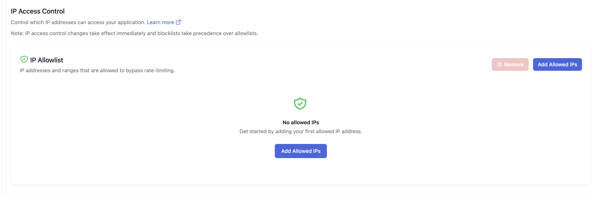
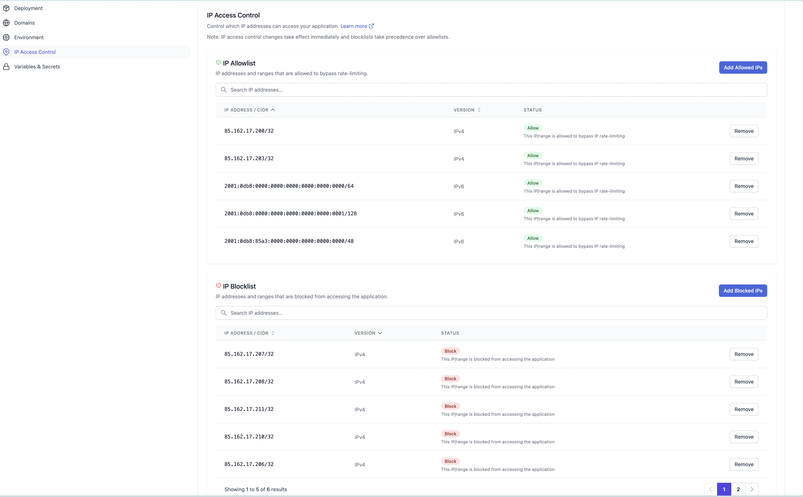

# IP Access Control

The **IP Access Control** feature allows administrators to manage
network access and rate limiting at the IP address level. This feature
complements the default Web Application Firewall (WAF) protections by
enabling more granular control over which IPs are blocked or allowed to
bypass rate limits.

For more information on WAF and default rate limits, see the [Firewall documentation](docs://cloud/firewall/).

## Feature Overview

- **Blocklist**: Deny all access from specific IP addresses or ranges.
- **Allowlist**: Permit specified IP addresses or ranges to bypass WAF rate limits.

This feature is accessible from the Altis Dashboard and is designed for
simple, effective access management.

## Blocklist

The **Blocklist** allows you to deny all traffic originating from specified IP addresses or IP ranges. Any
request from a blocklisted IP will be automatically rejected and will not reach your application.

**Use Cases:**

- Blocking malicious actors or IPs with suspicious activity.
- Preventing access from certain data centers often used for spam traffic.

> **Note:** You cannot add an IP address to the blocklist if it's already in the allowlist. To block an allowed IP, you must first remove it from the allowlist.

## Allowlist

The **Allowlist** lets you specify IP addresses or ranges that are exempt from the default WAF rate limits.
Requests from allowlisted IPs will not be subject to rate limiting, ensuring uninterrupted access.

**Use Cases:**

- Ensuring trusted partners or internal teams are never rate-limited.
- Allowing monitoring or uptime services unrestricted access.

> **Note:** Only use the allowlist for trusted IPs, as bypassing rate limits can increase exposure to abuse.

## Managing IP Lists

### Adding an IP or Range

1. Navigate to the **IP Access Control** section in the Altis Dashboard.
2. Choose either the **Blocklist** or **Allowlist** tab.
3. Click **Add IP**.
4. Enter the desired IP address or CIDR range (see [IP Range Limitations](#ip-range-limitations)).
5. Click **Save**.

### Removing an IP or Range

1. In the appropriate list (Blocklist or Allowlist), locate the IP or range you wish to remove.
2. Click the **Delete** button next to the entry.
3. Confirm the deletion when prompted.

## IP Range Limitations

- Only IP addresses or ranges up to a maximum of **/24** are supported (e.g., `192.168.1.0/24`).
- Larger ranges (e.g., `/16`) are **not allowed**.
- Both IPv4 and IPv6 addresses are supported (with similar range limitations).

## Example Entries

- **Single IP:** `203.0.113.42`
- **Range (CIDR):** `203.0.113.0/24`

## Related Documentation

- [Firewall and Rate Limiting](docs://cloud/firewall/)
