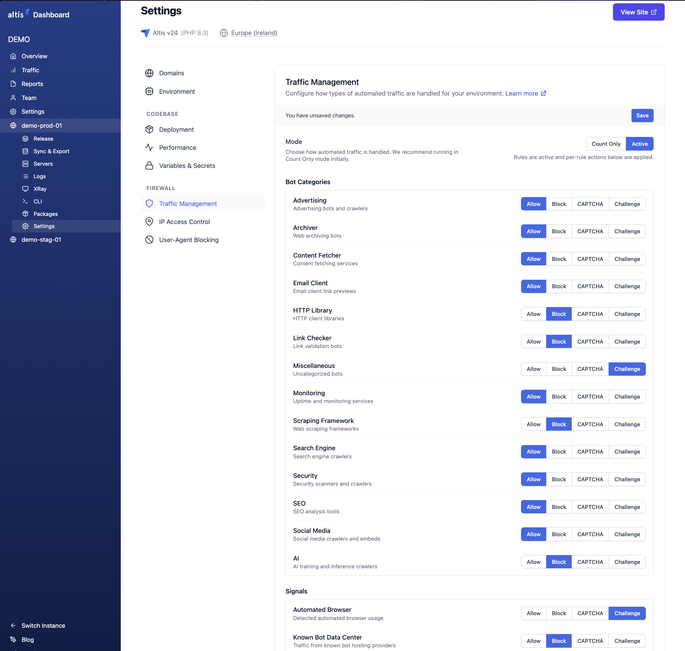
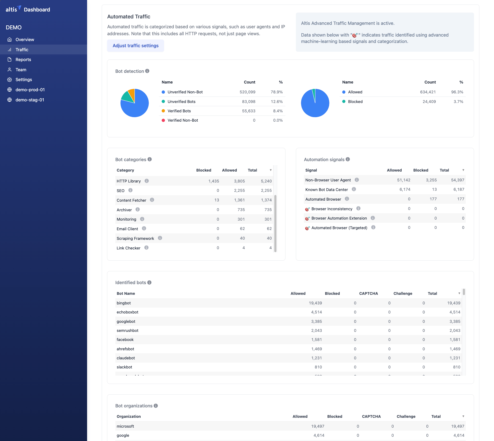

# Traffic Management

**Traffic Management** gives you self-service control over the automated traffic — bots,
crawlers, scrapers, and scripted clients — that reaches your environment. Rather than
maintaining lists of individual user agents, you control traffic at the level of *categories*
(such as AI crawlers or SEO tools) and *signals* (such as requests from known data centers),
choosing to allow it, block it, or require it to prove it's human.

Traffic Management extends the default [Web Application Firewall](./README.md) protections available to
all Altis customers with the detection and control capabilities provided by AWS WAF Bot Control. Altis
handles the underlying setup and surfaces AWS WAF detection results in plain language through the
Dashboard, giving you self-service control over automated traffic without requiring any code or
configuration changes. You decide what to allow, block, or challenge.

More advanced detections, such as silent background Challenge actions and machine-learning-based
targeted rules, require the Advanced Traffic Management add-on. See [What the Advanced Traffic
Management add-on adds](#what-the-advanced-traffic-management-add-on-adds) for more details.

For simpler, HTTP header-based control, see [User-Agent Blocking](./ua-blocking.md). To manage
access at the IP address level, see [IP Access Control](./access-control.md).

## What Traffic Management does

Every request to your environment is inspected and classified using a range of signals —
user-agent strings, IP address reputation, request patterns, and (for the add-on) browser
interrogation and machine-learning analysis. Traffic Management lets you:

- **See** how much of your traffic is automated, broken down by category and signal.
With the [add-on](#what-the-advanced-traffic-management-add-on-adds), you can also see individual bot names and the organizations behind them..
- **Decide** how each type of automated traffic is handled: allow it, block it, or make it
  prove it's human.

Traffic Management appears in two places in the Dashboard:

- The **Traffic** page shows analytics: how your traffic breaks down between verified bots,
  unverified bots, and non-bot (human) requests, and what has been allowed or blocked.
- The **Traffic Management** settings page (under **Application Settings**) is where you
  configure the mode and choose an action for each rule.

## Key terminology

- **Bot** — any automated client, as opposed to a human using a browser. Bots are not
  inherently bad: search engine crawlers and monitoring services are bots you probably want
  to allow.
- **Verified vs. unverified** — a *verified* bot is one that identifies itself and whose
  identity Altis can independently confirm (for example, Googlebot crawling from Google's own
  IP ranges, or a bot using the Web Bot Auth protocol). An *unverified* bot claims an identity
  that cannot be confirmed, or none at all.
  Most rules only act on unverified traffic — verified bots are labelled but left alone.
- **Signal** — an indicator that a request is automated, such as coming from a known
  bot data center or using a non-browser user agent. Signals apply to traffic that doesn't
  fall into a clean category.
- **Category** — the *kind* of bot, such as a search engine, an SEO tool, or an AI crawler.
  Categories are determined from self-identifying signals like the user agent.
- **Token** — a small piece of session data AWS WAF issues to legitimate browsers. Many of
  the targeted protections rely on it to tell real
  browsers apart from bots. Tokens are issued automatically when the CAPTCHA or Challenge
  actions run.

## Mode

The **Mode** setting controls how Traffic Management behaves overall. We recommend starting in
**Count Only** mode, reviewing the Traffic page for a week or two to understand your traffic,
and only then switching to **Active**.

| Mode | Behaviour |
| --- | --- |
| **Disabled** | Rules are not active. No automated traffic is classified or acted on. |
| **Count Only** | Rules are evaluated and their matches are counted in your analytics, but **no requests are blocked or challenged**. This is the safe way to see what *would* happen before enforcing anything. |
| **Active** | Rules are enforced. The per-rule action you set for each category, signal, and protection is applied. |

## Actions

When Traffic Management is **Active**, each rule can be set to one of the following actions.
Setting a rule to anything other than **Allow** means matching requests are acted on.

| Action | What happens |
| --- | --- |
| **Allow** | Matching requests are permitted through. Use this for traffic you want to keep, such as search engines. |
| **Block** | Matching requests are rejected with an HTTP `403` and never reach your application. |
| **CAPTCHA** | Matching requests are shown a CAPTCHA puzzle on an interstitial page. Humans can solve it and continue; most bots cannot. Solving it issues a token so the visitor isn't repeatedly challenged. |
| **Challenge** | Matching requests are given a silent, background browser check — no puzzle is shown. Real browsers pass automatically and invisibly; automated clients that can't run the challenge are stopped. **Challenge is available only with the [Advanced Traffic Management add-on](#what-the-advanced-traffic-management-add-on-adds).** |

The CAPTCHA puzzle is accessible — it offers both visual and audio variants and is available
in multiple languages. The interstitial page shown while a CAPTCHA is pending **does not count
towards your page views**.

> **CAPTCHA vs. Challenge.** A CAPTCHA interrupts the visitor with a puzzle, so use it where
> some friction is acceptable, or where a rule might occasionally misidentify a real user and
> you'd rather give them a way through than block them outright. A Challenge is invisible to
> real users, making it the better default for protecting normal pages — if you have the
> [Advanced Traffic Management add-on](#what-the-advanced-traffic-management-add-on-adds).

## Rule groups

The settings page splits the rules into three groups.

### Bot Categories

Bots that identify themselves are grouped into categories based their purpose. Blocking or challenging a category
affects only unverified bots in it — verified bots like Googlebot are left alone. AI is the one
exception (see below).

| Category | Description |
| --- | --- |
| Advertising | Advertising bots and crawlers |
| Archiver | Web archiving bots |
| Content Fetcher | Content fetching services (e.g. RSS readers) |
| Email Client | Email client link previews |
| HTTP Library | HTTP client libraries used by scripts and APIs |
| Link Checker | Link validation bots |
| Miscellaneous | Uncategorized bots |
| Monitoring | Uptime and monitoring services |
| Scraping Framework | Web scraping frameworks |
| Search Engine | Search engine crawlers |
| Security | Security scanners and crawlers |
| SEO | SEO analysis tools |
| Social Media | Social media crawlers and link-preview embeds |
| AI | AI training and inference crawlers |

> **The AI category works differently.** Unlike other categories, the action you choose for the AI category applies
> to *all* matching bots, verified or not. This lets you block AI crawlers even when
> they identify themselves honestly.

### Signals

Signals are indicators that a request is automated, these are used for traffic that doesn't fall into a clean category.

| Signal | Description |
| --- | --- |
| Automated Browser | The client browser shows indicators of being automated (e.g. headless or scripted). |
| Known Bot Data Center | The request originates from a hosting provider or data center commonly used by bots. |
| Non-Browser User Agent | The user-agent string doesn't look like a real web browser (often API clients). |

### Targeted Protections

The most sophisticated detections, aimed at bots that deliberately hide and don't identify
themselves. These use browser checks, fingerprinting, request-rate analysis, and
machine learning. **Targeted Protections require the [Advanced Traffic Management add-on.](#what-the-advanced-traffic-management-add-on-adds)**

They fall into a few families:

- **Volumetric** — abnormally high request volumes from a single IP or session in a short
  window (including sessions with no valid token).
- **Token-based** — requests missing a valid session token, which most real browsers carry.
- **Targeted signals** — token-level evidence of automation: automated browsers, browser
  automation extensions (such as Selenium), and inconsistent browser fingerprints.
- **Coordinated activity (ML)** — machine-learning detection of distributed, coordinated bot
  campaigns spread across many IP addresses, reported at Low, Medium, and High confidence.
- **Token reuse (ML)** — a single token being reused across many distinct IP addresses,
  countries, or networks (ASNs), reported at Low, Medium, and High confidence.

Because these rules escalate by confidence level, a common pattern is to Challenge or CAPTCHA
the lower-confidence levels and Block only the high-confidence ones.

## Reading the Traffic page

The **Traffic** page in the Dashboard shows how your automated traffic breaks down. Note that
these counts cover *all* HTTP requests, not just page views.

- **Bot detection** — the split between verified bots, unverified bots, and non-bot (human)
  traffic, and how much was allowed vs. blocked.
- **Bot categories** and **Automation signals** — how much traffic matched each category and
  signal, with the action taken.
- **Identified bots** and **Bot organizations** — the specific named bots and the companies
  operating them. *These tables require the Advanced Traffic Management add-on.*

Use Count Only mode together with this page to understand your traffic before enforcing any
blocking.

## What the Advanced Traffic Management add-on adds

Every Altis customer gets bot categories and signals with the Allow, Block, and CAPTCHA actions.
The **Advanced Traffic Management add-on** adds:

- **Targeted Protections** — the machine-learning and fingerprint-based rules above.
- **The Challenge action** — silent background browser checks, so you can stop bots without
  showing anyone a puzzle.
- **Richer analytics** — the Identified bots and Bot organizations tables on the Traffic page,
naming the specific bots hitting your site and the companies behind them.

To enable the add-on, or for help deciding whether it's right for your site, contact your
account manager or Altis support.

## Best practices

- **Start in Count Only.** Enable Traffic Management in Count Only mode and watch the Traffic
  page before enforcing anything, so you can see what would be affected.
- **Protect verified bots you rely on.** Leave categories like Search Engine on Allow so you
  don't harm SEO. Remember verified bots are generally left alone regardless.
- **Prefer Challenge over Block for page traffic.** A background Challenge stops bots without
  inconveniencing real visitors; reserve Block for traffic you're confident is unwanted.
- **Escalate targeted rules by confidence.** Challenge or CAPTCHA the Low/Medium levels and
  Block only High/Maximum, to minimise false positives.
- **Review regularly.** Bot behaviour changes; revisit the Traffic page periodically and
  adjust your actions.

If legitimate users report being blocked or repeatedly challenged, relax the responsible rule
or switch it to Count Only, and contact Altis support if you're unsure which rule is
responsible.

## Related Documentation

- [Web Application Firewall](./README.md)
- [User-Agent Blocking](./ua-blocking.md)
- [IP Access Control](./access-control.md)
