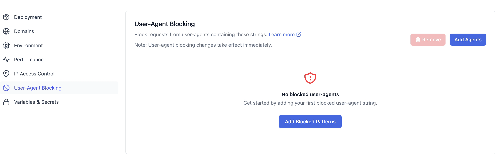
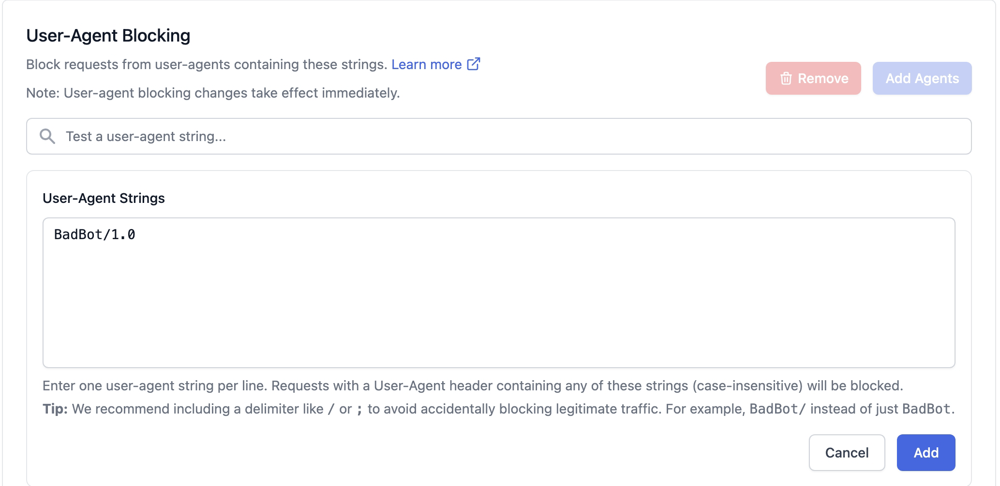
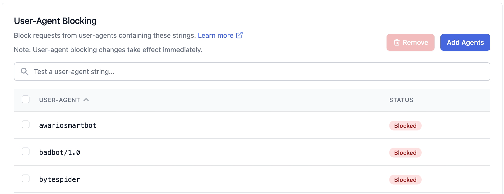
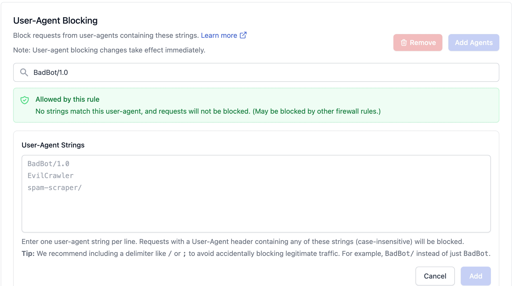
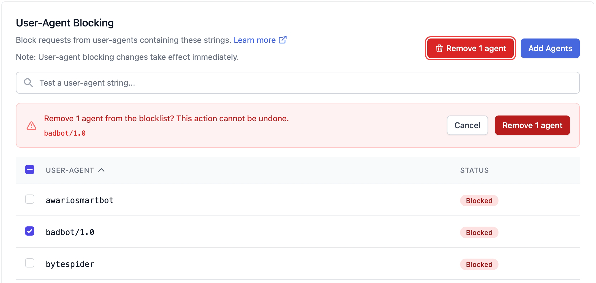

# User-Agent Blocking

The **User-Agent Blocking** feature allows administrators to block requests based
on the `user-agent` header they send. This complements the default Web Application
Firewall (WAF) protections by giving you a simple way to block unwanted clients —
such as crawlers, scrapers, or AI bots — from reaching your application.

For more information on the WAF and default protections, see the [Firewall documentation](docs://cloud/firewall/).
To manage access at the IP address level instead, see [IP Access Control](./access-control.md).

## Feature Overview

- Block traffic from clients whose `user-agent` header **contains** a string you specify.
- Manage the blocklist from the Altis Dashboard — no code or configuration changes required.
- Changes take effect **immediately**.

This feature is accessible from the Altis Dashboard under **User-Agent Blocking**,
and is designed for simple, effective control over automated traffic.

## How It Works

Each entry in the blocklist is a plain text string. Every incoming request is
inspected, and if its `user-agent` header contains any of your blocked strings,
the request is rejected at the CDN/WAF edge with an HTTP `403 Forbidden` response
and never reaches your application.

Matching behaviour:

- **Substring match.** An entry matches if it appears *anywhere* within the
  `user-agent` header. For example, the entry `bytespider` blocks the user agent
  `Mozilla/5.0 (compatible; Bytespider; ...)`.
- **Case-insensitive.** The casing of your entry does not matter — `BadBot`,
  `badbot`, and `BADBOT` all behave identically. (Entries are shown in lower case
  in the list.)
- **Any match blocks.** A request is blocked if its user agent matches any one of
  your entries.

Common use cases include:

- Blocking AI training and scraping bots (e.g. `GPTBot`, `Bytespider`, `ClaudeBot`).
- Blocking poorly-behaved crawlers that ignore `robots.txt` or generate excessive load.
- Blocking scripted clients and tools you don't want accessing the site.

> **Note:** User-agent blocking changes take effect immediately.

## Adding an Entry

1. Navigate to the **User-Agent Blocking** section in the Altis Dashboard.
2. Click **Add Agents** (or **Add Blocked Patterns** if the list is currently empty).
3. In the **User-Agent Strings** box, enter one `user-agent` string per line.
4. Click **Add**.

The new entries appear in the list below with a **Blocked** status.

> **Tip:** We recommend including a delimiter such as `/` or `;` to avoid
> accidentally blocking legitimate traffic — for example, `BadBot/` instead of just
> `BadBot`. Because matching is a substring check, an overly generic entry can match
> real browsers or services you want to keep.

## Testing an Entry

Use the **Test a user-agent string…** box at the top of the list to check whether a
given user agent would be blocked by your current entries. Paste a full `user-agent`
value to confirm that your blocklist matches the clients you intend — and does not
match ones you want to allow — before relying on it.

## Removing an Entry

1. In the **User-Agent** list, tick the checkbox next to each entry you want to remove.
2. Click **Remove**.
3. Review the confirmation banner and click **Remove *N* agent** to confirm.

> **Note:** Removing an entry cannot be undone. If you remove one by mistake, add it
> again using the steps above.

## Best Practices

- **Use a delimiter.** Prefer `BadBot/` or `BadBot;` over a bare `BadBot` to reduce
  the chance of matching unrelated traffic.
- **Test before you rely on an entry.** Use the test box to verify an entry matches
  the clients you intend and nothing else.
- **Be specific.** A distinctive substring (e.g. `bytespider`) is safer than a short,
  common one that could appear in many user agents.

If a legitimate user reports being blocked, remove or narrow the responsible entry.
If you're unsure which entry is responsible, contact Altis support.

## Related Documentation

- [Firewall and Rate Limiting](docs://cloud/firewall/)
- [IP Access Control](./access-control.md)
