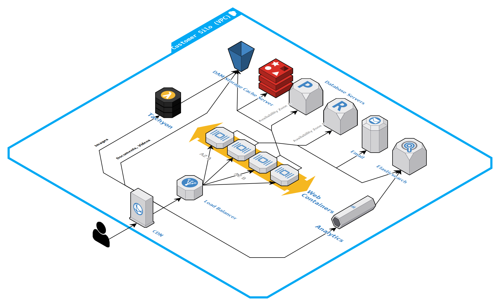

---
# Ensure this is first.
order: -100
---
# Architecture

The Altis Cloud architecture is a highly-available, resilient, autoscaling cloud system built to handle any level of traffic. Altis Cloud has been designed from the ground up to be flexible, scalable, and performant, while minimising cost.

Each environment tier includes as standard:

* Global CDN, powered by Amazon CloudFront
* Load balancer
* Automatically-scaling application servers (PHP)
* Database servers (MySQL)
* Object caching servers (Redis)
* Search servers (Elasticsearch)
* Scheduled jobs servers
* Asset storage & microservices

The application servers run your Altis-based application, and automatically scale to meet demand. This allows your site to respond dynamically to huge traffic spikes while remaining fast, without incurring any additional cost.

Altis manages the deployment, maintenance, and management of these services, providing you with a comprehensive web application platform. The Altis team manages the underlying virtual servers for you, including monitoring and right-sizing.

## Overview

Running a web application like Altis requires running multiple infrastructure components. Altis uses dedicated, specialized services for each component, rather than handling each service on one machine. This provides better performance characteristics by ensuring services have the best resources for their need, and allows each service to scale independently.

Every client and every environment is fully segregated from each other using logical controls at the network level, backed by AWS security controls.

Altis Cloud is designed to be highly-available, with redundant servers split across multiple availability zones, which are physically-independent data centres. Each set of availability zones are located in the [same physical region](./origin-locations.md). This ensures resiliency and redundancy of your data and application.

(Note that full HA is not included with all environment tiers; consult your plan information. High availability is also only available on production environments.)

Automated systems monitor and scale your environments to meet load demands, with no manual intervention. All systems are monitored 24/7 by a dedicated team of on-call cloud engineers around the globe. Engineers are alerted to anomolies within the system, including high CPU usage, disk space issues, slow load times for users, database errors, PHP errors, and database performance, among other issues and metrics.

## Content delivery network

Altis Cloud includes a global [content delivery network (CDN)](./cdn/) powered by [Amazon CloudFront](https://aws.amazon.com/cloudfront/).

The CDN has [more than 300 edge locations](./cdn/) distributed across the globe, ensuring that content is served from the location closest to users.

The CDN is deeply integrated into the Altis Cloud. Pages generated by your application are [cached within the CDN in regional cache nodes](./page-caching.md), minimising page load time for users. Static assets (including JS, CSS, and images in your codebase) are [stored in long-lived caches](./static-file-caching.md).

Uploaded media on your site is also automatically optimized by the CDN using [Tachyon](docs://media/dynamic-images.md), our image processing service.

*Note:* As Altis integrates the CDN at a deep level, [use of other CDNs](./cdn/third-party.md) is not possible without custom configuration, available only with Enterprise plans.

## Application containers

Your Altis Cloud environments consist of a swarm of application containers. These containers run Altis and WordPress, and connect to your database and cache servers. These environments also have strict access controls applied to ensure minimal access.

Three types of application containers are run within your environment:

* **Web containers** handle any incoming traffic from web requests, and serve the website up to your users. These automatically scale to meet traffic demands, with limitations applied based on your plan.

* The **sandbox container** is a copy of the web container with some access controls relaxed, and is used for [maintenance tasks via CLI access](./dashboard/cli.md)

* **Cavalcade containers** handle [running scheduled and background tasks](./scheduled-tasks.md). These automatically scale based on the number of pending tasks, allowing huge numbers of tasks to be run simultaneously.

Containers are treated as "throwaway" instances, which contain a copy of your codebase and Altis modules. No data is stored in application containers, allowing problematic containers to be removed and replcaed at any time. Containers can also be added or removed dynamically, handling load during high traffic events (known as "horizontal scaling").

Traffic is routed to containers through a load balancer. This load balancer ensures traffic is distributed across containers evenly, and ensures that containers being added or removed are seamlessly added to the pool. The load balancer also acts as the firewall and ingress point to your environment, with strict security controls at the network and application layers.

Web containers automatically collect application performance monitoring (APM) data, which is available through the Altis Dashboard.

## Database servers

Each environment contains at least one MySQL database server, which is the "writer" instance. Production environments on HA plans also include a minimum of one replica instance, which is used as a "reader".

Database servers will automatically scale based on load, adding and removing additional reader instances as needed (known as "horizontally scaling"). Reader instances are automatically distributed across availability zones, and can be promoted to writers for instant disaster recovery.

Database servers can also be allocated more resources (known as "vertical scaling"). The Altis team manages your database instance type based on your typical load patterns and your environment plan. On higher tiers, your server infrastructure can also be allocated a database proxy, which acts as a load balancer for database connections, improving performance.

## Object caching servers

Each environment contains at least one Redis server, used for persistent [object caching](./object-cache.md). This server acts as a key-value cache store, offloading expensive queries from the database, using the [WordPress Object Cache interface](https://developer.wordpress.org/reference/classes/wp_object_cache/).

On high-availability plans, an additional hot-standby replica runs in a separate availability zone, ensuring resilience against hardware failures.

The Altis Cloud module handles configuration and integration of the object cache into WordPress core systems, ensuring optimal performance.

## Asset storage and serving

Assets uploaded to Altis are stored in dedicated asset storage, powered by Amazon S3. This storage is flexible and able to scale to any size, while remaining resilient and available at all times.

Image assets are automatically served through our [Tachyon dynamic image service](docs://media/dynamic-images/), which resizes and optimizes images for users' devices. Tachyon is integrated directly into the Altis CDN.
