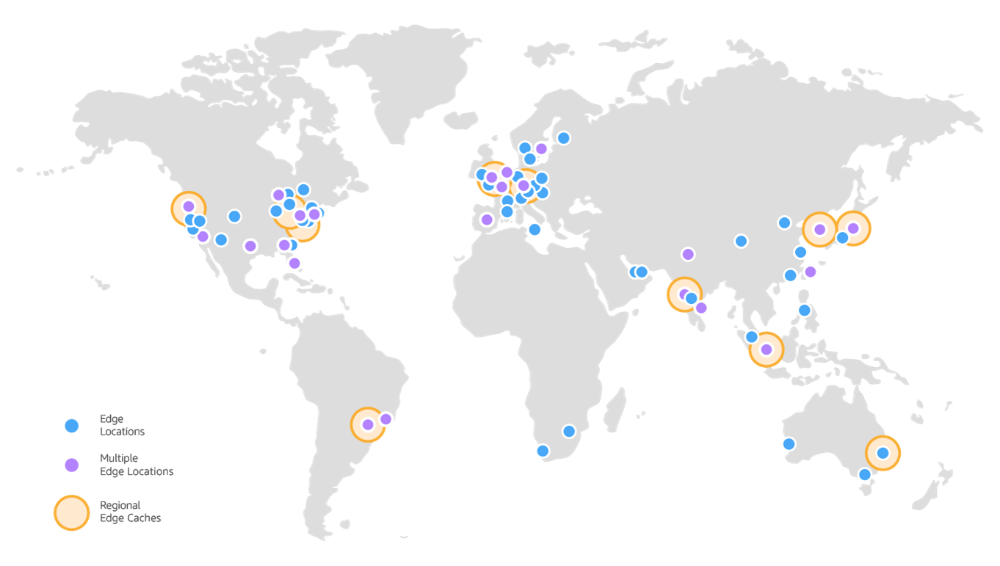

# CDN

All static assets, uploaded files and cached pages generated by Altis are cached on a global CDN (Content Delivery Network) to ensure the best performance for website end-users. We make use of [AWS CloudFront](https://aws.amazon.com/cloudfront/features/) to provide scalable, secure and fast delivery of content.

## Locations

The closer a user is to a CDN node, the faster a request will be completed. Altis provides 169 CDN node locations globally.

<small>Image Credit: Amazon</small>

**North America**

Edge locations: Ashburn, VA (6); Atlanta, GA (6); Boston, MA (3); Chicago, IL (6); Dallas/Fort Worth, TX (6); Denver, CO (2); Hayward, CA; Hillsboro, OR (3); Houston, TX (4); Jacksonville, FL; Los Angeles, CA (5); Miami, FL (4); Minneapolis, MN; Montreal, QC; New York, NY (2); Newark, NJ (7); Palo Alto, CA; Philadelphia, PA (2); Phoenix, AZ (2); Salt Lake City, Utah; San Jose, CA (2); Seattle, WA (3); Toronto, ON (2)

Regional Edge caches: Virginia; Ohio; Oregon

**Europe**

Edge locations: Amsterdam, The Netherlands (2); Athens, Greece; Berlin, Germany (2); Brussels, Belgium; Bucharest, Romania; Budapest, Hungary; Copenhagen, Denmark; Dublin, Ireland; Dusseldorf, Germany; Frankfurt, Germany (10); Hamburg, Germany; Helsinki, Finland; Lisbon, Portugal; London, England (9); Madrid, Spain (2); Manchester, England (2); Marseille, France; Milan, Italy (3); Munich, Germany (2); Oslo, Norway; Palermo, Italy; Paris, France (5); Prague, Czech Republic; Rome, Italy; Sofia, Bulgaria; Stockholm, Sweden (3); Vienna, Austria; Warsaw, Poland; Zurich, Switzerland (2)

Regional Edge caches: Frankfurt, Germany; London, England

**Asia**

Edge locations: Bangalore, India (3); Chennai, India (2); Hong Kong, China (3); Hyderabad, India (4); Kolkata, India; Kuala Lumpur, Malaysia (2); Mumbai, India (3); Manila, Philippines; New Delhi, India (4); Osaka, Japan; Seoul, South Korea (4); Singapore (4); Taipei, Taiwan(3); Tokyo, Japan (16)

Regional Edge caches: Mumbai, India; Singapore; Seoul, South Korea; Tokyo, Japan

**Australia**

Edge locations: Melbourne; Perth; Sydney (4)

Regional Edge caches: Sydney

**South America**

Edge locations: Bogota, Colombia; Buenos Aires, Argentina; Rio de Janeiro, Brazil (2); Santiago, Chile; São Paulo, Brazil (2)

Regional Edge caches: São Paulo, Brazil

**Middle East**

Edge location: Dubai, United Arab Emirates; Fujairah, United Arab Emirates; Manama, Bahrain; Tel Aviv, Israel

**Africa**

Edge locations: Cape Town, South Africa; Johannesburg, South Africa; Nairobi, Kenya

**China**

Edge locations: Beijing; Shenzhen; Shanghai; Zhongwei
