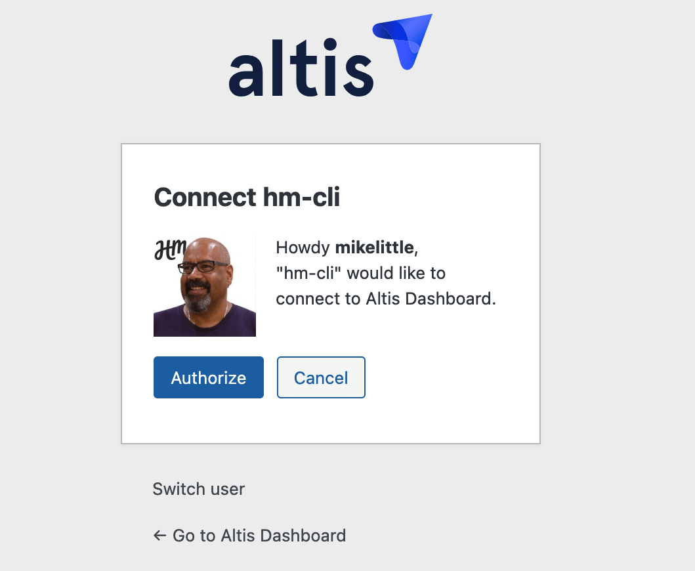
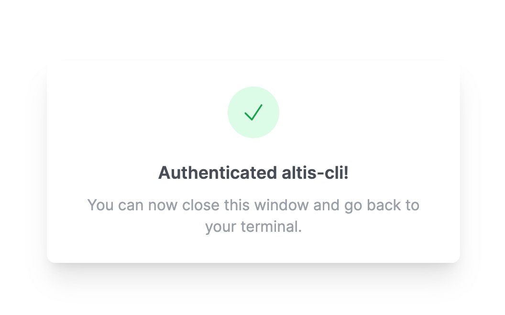

# Altis CLI

The Altis CLI tool provides a command line interface for running Altis utilities and commands. It is a wrapper around some of
the functionality available in the Altis Dashboard.

The tool is currently in beta, and we would love your feedback on the tool. You can determine the current version using
`altis-cli --version` and get help on the available commands using `altis-cli --help`.

## Installing

You need Node v18 or later.

To install it globally run the following command:

```sh
npm install -g altis-cli
```

To run the tool, use the following command:

```sh
altis-cli
```

Or you can run it using `npx`:

```sh
npx altis-cli
```

## commands available

The following commands are available in the Altis CLI tool

- `altis-cli cli` — Meta CLI commands
- `altis-cli config` — Configuration commands
- `altis-cli stack` — Stack commands

Each as one or more sub commands. Use `altis-cli help` to get the most up-to-date list of commands.

```sh
$ altis-cli  --help
altis-cli <command>

Commands:
  altis-cli cli     Meta CLI commands
  altis-cli config  Configuration commands
  altis-cli stack   Stack commands

Options:
  --version  Show version number
  --help     Show help          
```

## Meta CLI commands

```sh
Meta CLI commands

Commands:
  altis-cli cli clear-cache  Clear the cache file

```

### Clear cache

The app caches a list of the stacks you have access to. This command clears that cache.

```sh
$ altis-cli cli clear-cache
✔ Cleared cache
```

## Configuration commands

These commands manipulate the stored access configuration. The command stores your authentication token with the Altis Dashboard in
a private file in your profile.

- On Mac this file is stored in `$HOME/Library/Application Support/hm-cli/config.json`
- On Windows, if `LOCALAPPDATA` is defined, it is stored in  `$LOCALAPPDATA\hm-cli\config.json`. Otherwise, it is stored in
  `$USERPROFILE\Local Settings\Application Data\hm-cli\config.json`
- On Linux, if the environment variable `XDG_CONFIG_HOME` is defined, it is stored in `$XDG_CONFIG_HOME/hm-cli/config.json`.
  Otherwise in  `$HOME/hm-cli/config.json`

```sh
$ altis-cli config

Configuration commands

Commands:
  altis-cli config reset   Reset configuration
  altis-cli config setup   Set up configuration
  altis-cli config status  Show stored configuration
```

### Config setup

```sh
$ altis-cls config setup
Welcome to altis-cli!
? Run initial setup? Yes
Saved configuration!
Run altis-cli config setup at any time to run setup.
```

This will run the Altis Dashboard in your default browser and prompt to log in to the dashboard. It creates an authentication
key and stores it in the `config.json` file.



Once you are authenticated, you see this screen



### Config reset

Running config reset will clear the authentication token from the configuration file.

### Config status

Running config status will list the username you are connected to Altis Dashboard with.

## Stack commands

Altis CLI allows you to interact with the stacks you have access to. The following commands are available:

```sh

Commands:
  altis-cli stack backup [stack]       Create a new backup for the stack.
  altis-cli stack backups [stack]      List backups for the stack.
  altis-cli stack deploy [stack]       Deploy a given stack.
  altis-cli stack info [stack]         Get information for a stack.
  altis-cli stack list                 List stacks available in our hosting.
  altis-cli stack local-setup [stack]  Setup an existing Altis stack locally.
  altis-cli stack php-logs [stack]     Show PHP logs for a stack.
  altis-cli stack scp <src> <dest>     Copy a file to/from a stack. Remote
                                       src/dest are determined by a colon in the
                                       input, e.g. stack:/usr/src/app.
  altis-cli stack ssh [stack]          SSH into a stack.
```

### Stack backup

The `stack backup` command is used to create and download backups for your application. Note the default is to include both database
and downloads in the backup.

```sh
altis-cli stack backup [stack]

Create a new backup for the stack.

Options:
  --version   Show version number                                      [boolean]
  --help      Show help                                                [boolean]
  --uploads   Include uploads in the backup.
              (--no-uploads to disable)                [boolean] [default: true]
  --database  Include database in the backup.
              (--no-database to disable)               [boolean] [default: true]
  --resume    Log ID for resuming an existing deploy.                   [string]
  --debug     Enable internal debugging information.  [boolean] [default: false]
```

For example, to create a database only backup, you would run the following command:

```sh
altis-cli stack backup --database --no-downloads platform-test

Starting backup for platform-test...
(node:72569) [DEP0040] DeprecationWarning: The `punycode` module is deprecated. Please use a userland alternative instead.
(Use `node --trace-deprecation ...` to show where the warning was created)
Backup started, resume later with...
  altis-cli stack backup platform-test --resume platform-test/backups:2025-02-10-11-33-07

Connected!
Starting new backup.
Testing databases connection.
Running mysqldump. Database size: 917mb
→ mysqldump: [Warning] Using a password on the command line interface can be insecure.
→ -- Connecting to platform-test-89c846f8.cnwdi9lvvkax.eu-west-1.rds.amazonaws.com...
→ -- Retrieving table structure for table wp_10_commentmeta...
→ -- Sending SELECT query...

...

→ -- Retrieving rows...
→ -- Disconnecting from platform-test-89c846f8.cnwdi9lvvkax.eu-west-1.rds.amazonaws.com...
Writing tar file.
Uploading backup to S3. (111.13 MB)
Writing manifest file.
✔ Complete!
```

If a backup is going to take a long time and in case it may time out, the command outputs the resume command to use to resume
the same backup.

```sh
Backup started, resume later with...
  altis-cli stack backup platform-test --resume platform-test/backups:2025-02-10-11-33-07
```

### Stack backups

This command lists all the backups saved against the named stack. For example:

```sh
$ altis-cli stack backups platform-test
⠋ Loading backups for platform-test…
✔ Loading backups for platform-test…
? Select backup to download: (Use arrow keys)
❯ platform-test-2025-02-10-12-16-24 (111.13MB)
  platform-test-2025-02-10-12-13-34 (111.13MB)
  platform-test-2025-02-10-12-10-28 (111.13MB)
  platform-test-2025-02-10-11-38-21 (111.13MB)
  platform-test-2025-02-05-12-41-11 (65.86GB)
  platform-test-2025-01-31-13-46-53 (111.07MB)
  platform-test-2025-01-28-2-24-40 (111.04MB)
(Move up and down to reveal more choices)
```

Use your arrow keys to scroll through the backup names. It also displays the backup size. Pressing enter will download the
specified back up to your default `Downloads` directory.

```
Downloading to /Users/username/Downloads/platform-test-2025-02-10-12-16-24
✔ Downloaded. Copied /Users/username/Downloads/platform-test-2025-02-10-12-16-24 to clipboard.
```

### Stack deploy

This command allows you to deploy (or redeploy) a previously build version of your application.

```sh
$ altis-cli stack deploy --help
altis-cli stack deploy [stack]

Deploy a given stack.

Options:
  --version  Show version number                                       [boolean]
  --help     Show help                                                 [boolean]
  --debug    Enable internal debugging information.   [boolean] [default: false]
  --force    Force updating, even if the stack is already deployed.
                                                      [boolean] [default: false]
  --resume   Log ID for resuming an existing deploy.                    [string]
```

The command shows you as list of builds (listed by their build hash and date). Use the arrow keys to scroll through them, and
press enter to choose one.

If the one you choose is not the latest build, it will inform you the stack is already up-to-date (has a newer build
deployed) and remind you to use the `--force` flag to deploy an older build.

```sh
$ altis-cli stack deploy platform-test
⠋ Loading builds for platform-test…
✔ Loading builds for platform-test…
? Select build to use: platform-test:7f6af7f7-5ee4-47d4-b130-c25e62ccdc13
Deploying platform-test...

✖ platform-test is already up to date.
You can force deployment with...
  altis-cli stack deploy platform-test --force
```

Note: If a build failed, Altis will not be able to find a docker image of that build to deploy.

Once you select the build to deploy, it works through the deployment process, showing you the progress as it goes.

```sh
$ altis-cli stack deploy platform-test --force
stty: 'standard input': unable to perform all requested operations
⠋ Loading builds for platform-test…
✔ Loading builds for platform-test…
? Select build to use: platform-test:c56d7dfc-d3f7-46b7-af16-05506bd5924b
Deploying platform-test...
Deploy started, resume later with...
  altis-cli stack deploy platform-test --resume platform-test/deploys:2189890216

Connected!
Creating new ECS task definitions
→ (service platform-test-app-e292cb32, taskSet ecs-svc/1721614815270478080) has started 1 tasks: (task 9668c44c73ed49a580a5cf0cfc895c63).
→ (service platform-test-app-e292cb32, taskSet ecs-svc/1721614815270478080) has started 1 tasks: (task 9668c44c73ed49a580a5cf0cfc895c63).
→ (service platform-test-cavalcade) has stopped 1 running tasks: (task a772955096f2455ab86041659723e22c).
→ (service platform-test-cavalcade) has started 1 tasks: (task 06d635f5e6a94244acea677a1d144658).
→ (service platform-test-cavalcade, taskSet ecs-svc/4337684288467624732) has started 1 tasks: (task 06d635f5e6a94244acea677a1d144658).
→ (service platform-test-sandbox) has stopped 1 running tasks: (task 6383730c9dbc441e97b0a2e10e3e6ff7).
→ (service platform-test-app-e292cb32, taskSet ecs-svc/1721614815270478080) registered 1 targets in (target-group arn:aws:elasticloadbalancing:eu-west-1:577418818413:targetgroup/platf-2019030706162042900000000b/f06e0dc1abd7dffd)
→ (service platform-test-sandbox) has started 1 tasks: (task a4d683ac82a744e0b3900c9ca5dd2b0e).
→ (service platform-test-sandbox, taskSet ecs-svc/2091840170060279055) has started 1 tasks: (task a4d683ac82a744e0b3900c9ca5dd2b0e).
→ (service platform-test-app-e292cb32, taskSet ecs-svc/1721614815270478080) updated state to STEADY_STATE.
→ (service platform-test-app-e292cb32) has reached a steady state.
→ (service platform-test-cavalcade) (deployment ecs-svc/4337684288467624732) deployment completed.
→ (service platform-test-cavalcade) has reached a steady state.
→ (service platform-test-sandbox) (deployment ecs-svc/2091840170060279055) deployment completed.
→ (service platform-test-sandbox) has reached a steady state.
Monitoring health of new deployment for service platform-test-app-e292cb32 before shifting traffic. This will take a few moments.
Monitoring health of new deployment for service platform-test-app-e292cb32 before shifting traffic. This will take a few moments.
Completed service platform-test-cavalcade
Completed service platform-test-sandbox
New deployment of service platform-test-app-e292cb32 is healthy. Rerouting traffic.
New deployment of service platform-test-app-e292cb32 is healthy. Rerouting traffic.
Completed service platform-test-app-e292cb32
✔ Complete!
```

Once the deploy has completed, the change will also show up on the Altis Dashboard.

Note: if you have `autodeploy` enabled on ths stack in the Altis Dashboard, the command is unable to obtain a deployment lock and
thus cannot deploy.

### Stack info

The `stack info` command will list information about the specified stack. This information includes the status, the domains
associated with the stack, infrastructure, database, and web server information.

```sh
$ altis-cli stack info platform-test
⠋ Fetching information for platform-test

platform-test
  Status          available
  Domains         platform-test.aws.hmn.md, *.platform-test.aws.hmn.md, ticket-8438.wpexample.uk
  Load Balancer   platform-test-1175174569.eu-west-1.elb.amazonaws.com

  Infrastructure
    Version        terraform-ecs-application (6.13.0)
    AMI            ami-0a65435eb075d1da3
    Type           t4g.small

  Database
    ID             platform-test-89c846f8.cnwdi9lvvkax.eu-west-1.rds.amazonaws.com
    Status         available
    Size           db.t4g.small

  Web Servers (1)
    i-08011d6f8fccc9add
      IP             172.32.26.14
      Status         running
      Size           t4g.small
      Locked         Locked

  Elasticsearch
    ID             platform-test-7aa60229
    Size           t3.medium.elasticsearch
    Endpoint       search-platform-test-7aa60229-ybo6gqm4guree34bk4nx5z553u.eu-west-1.es.amazonaws.com
```

### Stack list

This command lists all the stacks you have access to.

### Stack local-setup

Running this command will checkout the code for the stack (using the information stored in Altis Dashboard), and run `composer 
install`, once the code is checked out.

```sh
$ altis-cli stack local-setup platform-test
⠋ Loading repository for platform-test…(node:48439) [DEP0040] DeprecationWarning: The `punycode` module is deprecated. Please use a userland alternative instead.
(Use `node --trace-deprecation ...` to show where the warning was created)
✔ Loading repository for platform-test…
Creating directory: ./platform-test
Cloning: git@github.com:humanmade/platform-test.git
Cloning into '.'...
Installing dependencies…
No composer.lock file present. Updating dependencies to latest instead of installing from lock file. See https://getcomposer.org/install for more information.
Loading composer repositories with package information
Updating dependencies
Lock file operations: 156 installs, 0 updates, 0 removals
  - Locking 10up/elasticpress (4.7.2)
  - Locking 10up/simple-local-avatars (2.7.11)
  - Locking altis/altis (21.0.0)

...

platform-test is now available at ./platform-test
Run `composer server start` to get started
```

### Stack php-logs

The php-logs command will show the php logs for the specified stack. It has a number of options to determine which sub set of logs
will be displayed.

```sh
$ altis-cli stack php-logs tail platform-test
altis-cli stack php-logs [stack]

Show PHP logs for a stack.

Options:
  --version  Show version number
  --help     Show help          
  --before   Date to logs must be before.
  --after    Date to logs must be after. 
  --tail     Live update log entries.    

```

For example, to specify only the log files after a certain date, you can call it like this:

```sh
altis-cli stack php-logs --after 2025/02/04 platform-test
```

You can combine the before and after parameters to limit the logs to a specific range of days.

```sh
altis-cli stack php-logs --after 2025/01/30 --before 2025/02/01 platform-test
```

You can also specify a time as part of the before and after parameters

```sh
altis-cli stack php-logs --after 2025/01/28T10:17 --before 2025/01/28T10:25 platform-test
```

Using the tail parameter will give you a live feed of logs entries as they are created. Use `CTRL+C` to exit the feed.

### Stack scp

```sh
$ altis-cli stack scp --help
altis-cli stack scp <src> <dest>

Copy a file to/from a stack. Remote src/dest are determined by a colon in the
input, e.g. stack:/usr/src/app.

Options:
      --version  Show version number                                   [boolean]
      --help     Show help                                             [boolean]
  -v, --verbose  Verbose mode.                                           [count]
```

This command allows you to copy a file from your local to the stack.

```sh
$ altis-cli stack scp ./Cheese-DSC05391.jpg platform-test:/tmp/Cheese-DSC05391.jpg
stty: 'standard input': unable to perform all requested operations
⠋ Connecting to platform-test
✔ Cheese-DSC05391.jpg          [============================================>] 100.0% (273.86KB/273.86KB, 365.15KB/s)
```

Or from the stack to your local device

```sh
$ altis-cli stack scp platform-test:content/themes/twentytwentytwo/assets/images/ducks.jpg ducks.jpg
⠋ Connecting to platform-test
✔ ducks.jpg          [<============================================] 100.0% (373.85KB/364.27KB, 221.54KB/s)
```

### Stack ssh

This command connects you to the stack sandbox. It gives exactly the same environment as the CLI command on Altis Dashboard.

```sh
Connected to platform-test sandbox. Your session will timout after 20 minutes of inactivity.
Note: This sandbox is connected to the live database and cache servers. Data operations will have permanent effect.

Common commands:
  wp cache flush
    Flush the object cache.

www-data@69bd895c6935:/usr/src/app$ ls
Dockerfile.gobinary  assets	  composer.json  content  hello.aarch64  index.php  tests   wordpress	wp-config-production.php
README.md	     build-go.sh  composer.lock  hello	  hello.x86_64	 main.go    vendor  wp-config-production-sample.php  wp-config.php

www-data@69bd895c6935:/usr/src/app$ wp theme list

+------------------+----------+--------+---------+----------------+-------------+---------+
| name             | status   | update | version | update_version | auto_update | enabled |
+------------------+----------+--------+---------+----------------+-------------+---------+
| twentynineteen   | active   | none   | 3.0     |                | off         | network |
| twentytwenty     | inactive | none   | 2.8     |                | off         | network |
| twentytwentyfour | inactive | none   | 1.3     |                | off         | network |
| twentytwentytwo  | inactive | none   | 1.9     |                | off         | network |
+------------------+----------+--------+---------+----------------+-------------+---------+
www-data@69bd895c6935:/usr/src/app$
```

You have the same functionality as you do in the Altis Dashboard CLI session.
