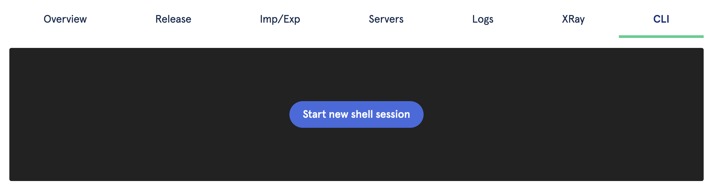
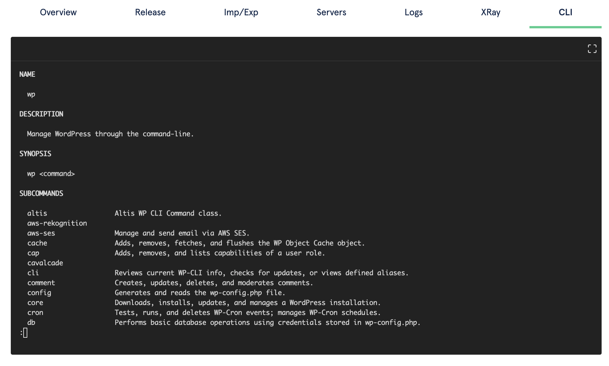
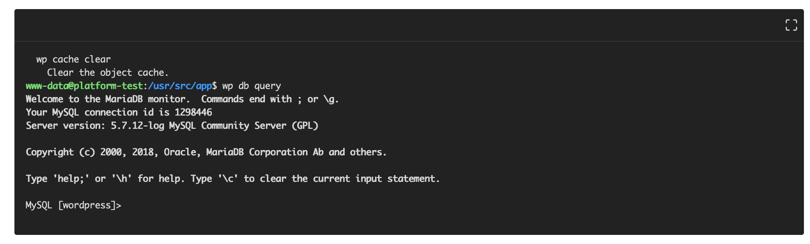

# CLI (Shell) Access

**Note:** This is a beta feature currently in development. To request access, contact Altis Support.

The Altis Dashboard provides direct CLI access to a sandbox environment, allowing you to run arbitrary commands and manage your site via wp-cli.

To get started, visit the CLI tab in the Dashboard, and click "Start new shell session". CLI access requires Developer or higher access to the environments.

## How CLI access works

Your Altis Cloud environments consist of a swarm of application containers. These containers run Altis and WordPress, and connect to your database and cache servers. These environments also have strict access controls applied to ensure minimal access.

Alongside these containers (called the "web" containers), we run an additional container called the "sandbox" container. This container does not serve web traffic, but is connected to your live database and cache servers. This means that **any operations performed on the sandbox will apply to your real database**.

The sandbox container also has some security controls relaxed. For example, while the filesystem is non-writable on web containers, the sandbox container does not have this restriction, allowing more advanced debugging and iteration. This relaxation is mitigated through the sandbox container being non-web-accessible, as well as full logging of the shell session.

## Available tools

The CLI tool provides a full connection to the sandbox server, with a full Bash shell available.

Within the container, you can download and run standard Linux software; for example, if you need to install helper tools for parsing data during a migration.

### wp-cli

For interacting with your Altis site, [wp-cli](https://make.wordpress.org/cli/handbook/) is installed and configured for you. This allows management of content, users, settings, and more directly from the shell.

Additionally, [custom commands](https://make.wordpress.org/cli/handbook/guides/commands-cookbook/) can be created and added to your custom codebase, then run at your convenience. This can be used for custom maintenance or configuration commands, as well as providing for custom migration scripts.

wp-cli can also be used to query your database, via the `wp db query` command. Running this command with no parameters will launch an interactive MySQL client session. This connection is to your live database writer instance, and **any destructive queries performed will apply to your real database**.

## Limitations

### Session timelimits

CLI sessions will time out after 20 minutes of inactivity, and have a hard limit of 60 minutes. For longer-running sessions, you may want to start a `screen` session that you can reconnect to, or contact Altis Support for help running longer-running commands.

### Container replacement

Sandbox containers are completely replaced with a clean container when a new build is deployed. Do not store anything in a sandbox container which needs permanent storage.

As sandbox containers are replaced when a new build is deployed, all existing sessions will also be ended. When running long-commands, we recommend disabling autodeploys and ensuring your team does not trigger manual deploys.
