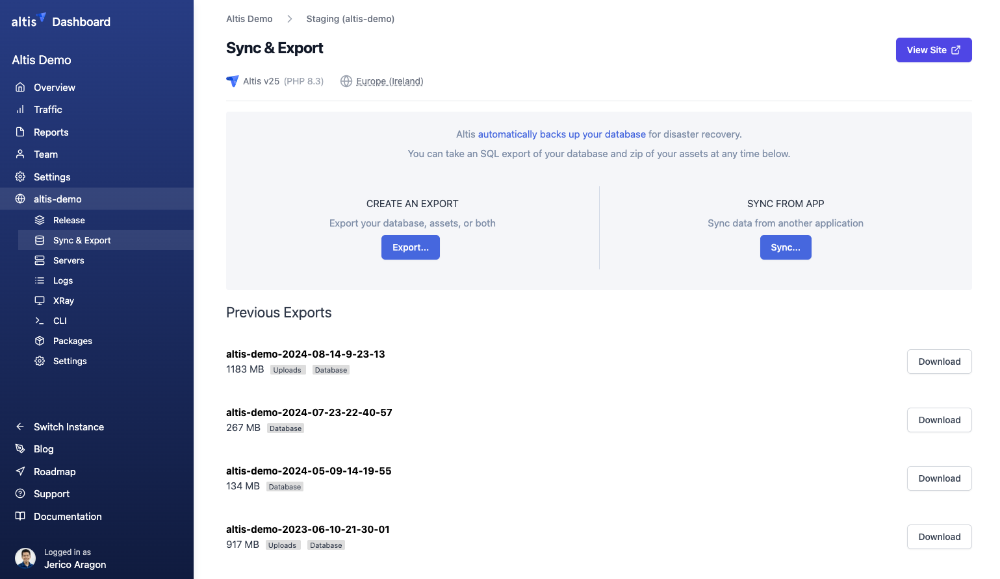
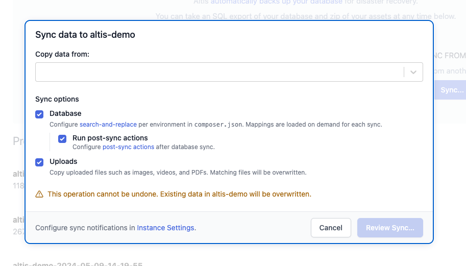
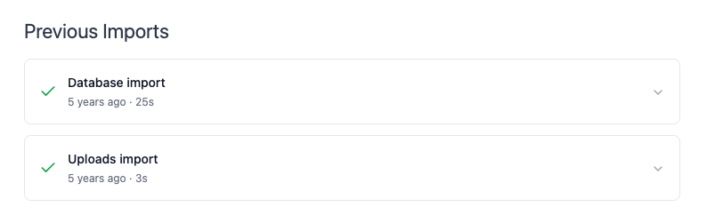
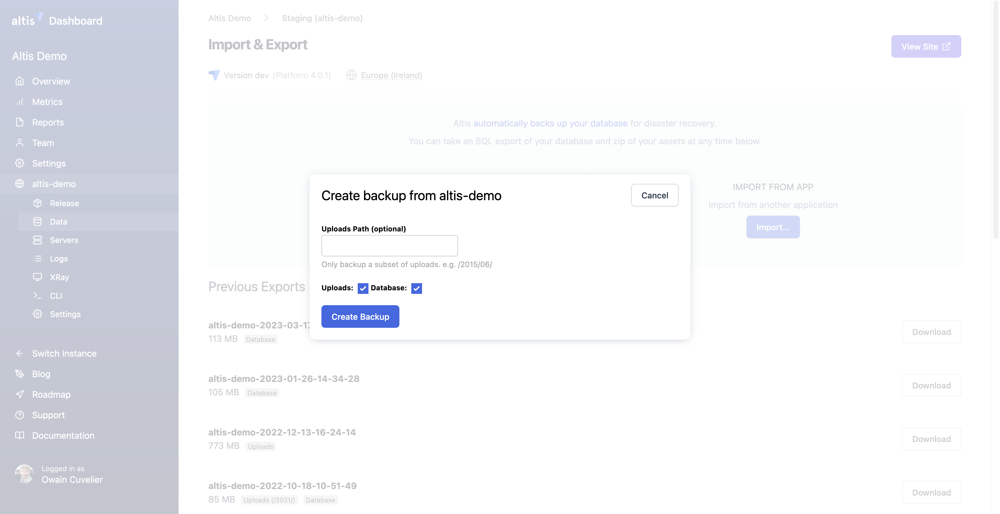

# Sync and Export

The Altis Dashboard allows you to perform data migrations between environments, as well as perform data exports for use in local
development environments.

You can find these features under the Sync and Export tab of the selected Altis Environment.

## Sync

Environment syncing copies data from one environment to another in a single, automated operation. It handles the database
import, uploads copy, [URL search-replace](./search-replace.md), cache flush, and any
[post-sync steps](docs://core/cli-command/#wp-altis-post-sync) automatically, without any manual intervention required.

### Starting a sync

1. In the Altis Dashboard, go to the **Sync and Export** tab of the environment you want to sync **into** (the destination).
2. Click **Sync**.
3. Under **Copy data from**, select the source environment.
4. Under **Sync options**, choose what to sync:
   - **Database.** Syncs the full database. Expand **Customize** to specify individual tables. URL mappings are applied
     automatically during the sync based on your [search and replace configuration](./search-replace.md).
   - **Run post-sync actions.** Runs any [post-sync actions](docs://core/cli-command/#wp-altis-post-sync)
     configured for the destination environment after the database sync.
   - **Uploads.** Copies uploaded files such as images, videos, and PDFs. Expand **Restrict to subpath** to limit the copy
     to a specific directory. Matching files will be overwritten.
5. Click **Review Sync** and confirm to start.

Progress is shown in real time, with each step listed as it completes. If a step fails, the error is shown inline alongside
the step that failed.

### Sync history

The Dashboard keeps a record of all sync operations for the environment, accessible from the **Sync and Export** tab.
Each entry shows who initiated the sync, the source and destination environments, and the status of each step including any errors.

## Export

From the **Sync and Export** tab you can view and download previous exports, displayed as a list, ordered by date.

You can also create a new export of your database and/or uploads folder.

To create a new export, press the export button. This will display a new pop-up (as shown below) in which you can choose to export
the uploads and/or the database. If you choose to create an export of the Uploads, you'll be able to optionally specify a path. This
is useful if you only want to export the uploads in a specific directory.

**Note:** These features are designed with the idea that 'code moves up, content moves down'. We do not recommend you migrate
content from non-production environments to production environments. Content should typically flow
from `production` -> `staging` -> `development` -> `test`, etc.
