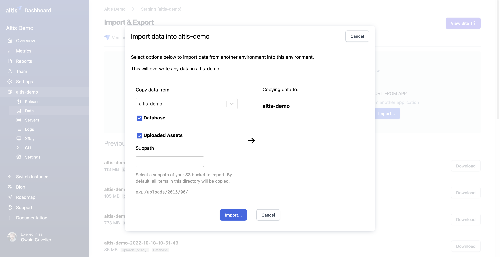

# Altis Dashboard Import Export

The Altis Dashboard allows you to perform data migrations between environments, as well as perform data exports for use in local development environments.

You can find the Import & Export features under the Data tab of the selected Altis Environment.

From here you can view and download previous exports, displayed as a list, ordered by date. 

You can also create a new export of your database and/or assets. Typically, this will be your WordPress Uploads directory, comprising your media uploads and any other assets your application store there.

To create a new export, you can press the export button. This will display a new pop-up (as shown below) in which you can choose to export the uploads and/or the database. If you choose to create an export of the Uploads, you’ll be able to optionally specify a path. This is useful if you’d quickly like to create an export of assets in a specific directory.

You can also import your database and assets from one environment to another, via the Altis Dashboard.

To do this, in the Altis Dashboard, first go to the environment you want to import into. Then select Import. A pop-up form will appear. You can select the source environment you will import from. You can choose database and/or uploaded assets. And, as mentioned above, you can select a sub-path of the assets, if desired.

Importing is a destructive, non-reversible process. Any existing data in the database will be deleted and replaced with the data from the source environment. **Important** Once the Import is complete, you will need to run a search-replace on the URLs in the database via the Altis CLI. 

**Important** before running the search-replace is to create a `screen` session, if you unfamiliar with screen sessions, checkout this helpful article: [https://linuxize.com/post/how-to-use-linux-screen/#starting-linux-screen](https://linuxize.com/post/how-to-use-linux-screen/#starting-linux-screen). As the [maximum CLI session time](https://docs.altis-dxp.com/cloud/dashboard/cli/#limitations) is 20 minutes, you'll need to run the search-replace in a `screen` session for longer running processes.

If you’d like to learn more or are unfamiliar with WP CLI search-replace command, it’s recommended to familiarise yourself with these commands. Make use of the `--dry-run` flag before making permanent changes to the database. See the following article for more information: [https://developer.wordpress.org/cli/commands/search-replace](https://developer.wordpress.org/cli/commands/search-replace/).

**Note:** These features are design with the idea that ‘code moves up, content moves down’, so we do not recommend this feature be used to migrate content from non-production environments to production environments; content should typically flow from production→staging→development→test, etc.
