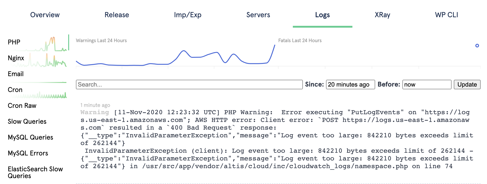
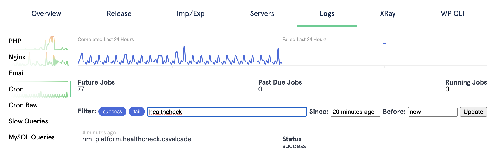

# Accessing Logs

You have access to several types of logging from sites on Altis have following logs available:

- PHP Error log (two week retention)
- Nginx Error log (two week retention)
- WordPress Cron task logs (via Cavalcade, indefinite retention)
- Email logs (one month retention)
- Access logs (via a custom REST API endpoint, indefinite retention)

The logs can be viewed via [Altis Dashboard](./README.md) under a site's Logs tab.

The date range can be specified for all logs types. Some log types will also support additional filtering such as cron logs.

