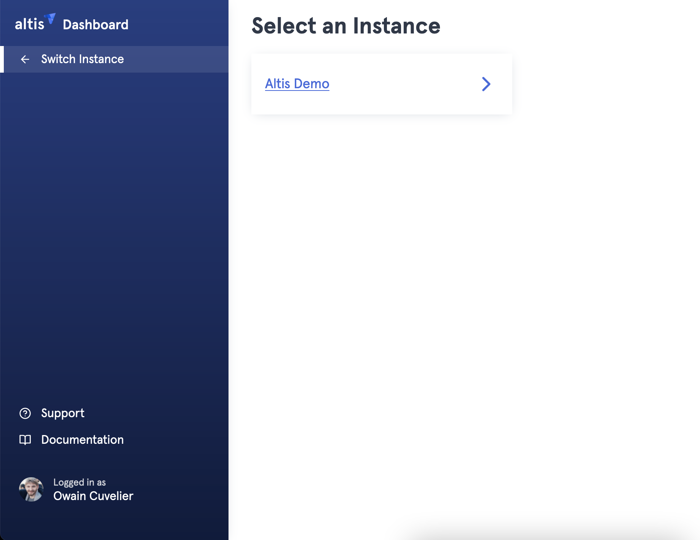
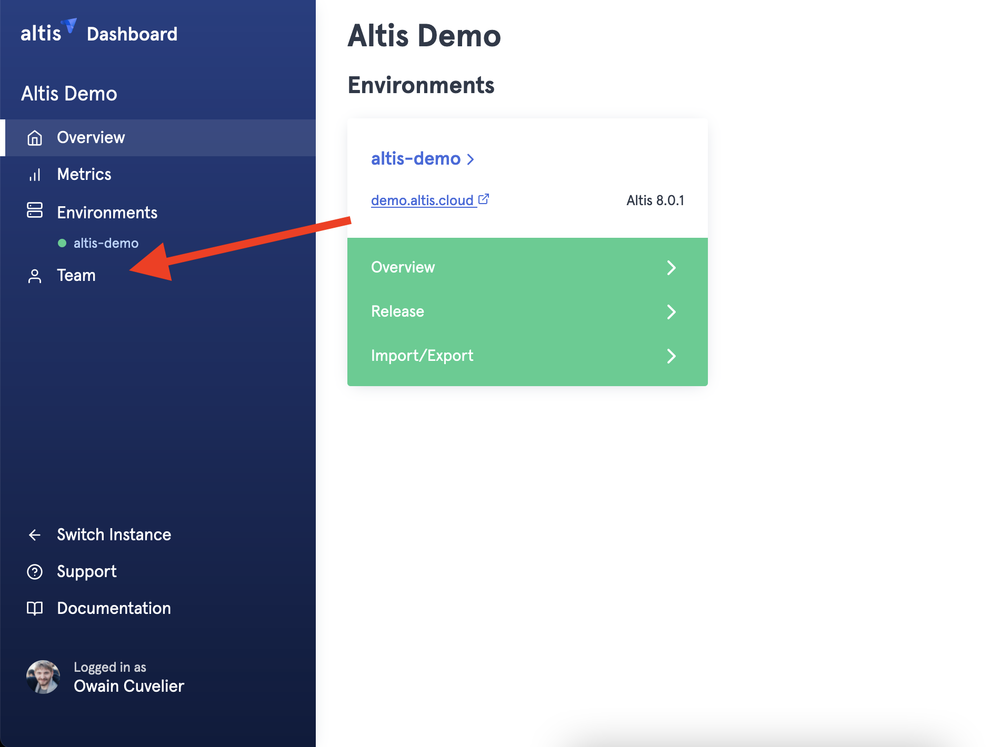
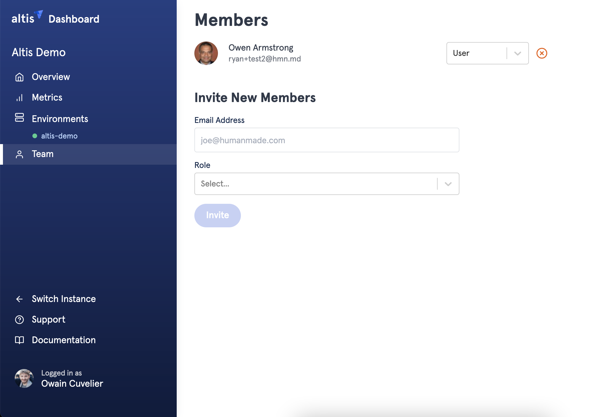
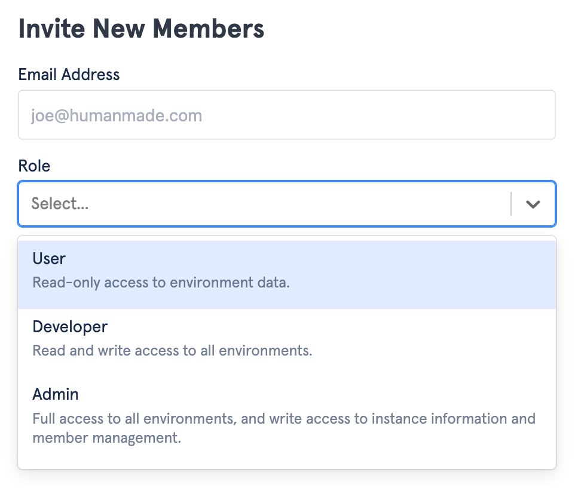

# Adding team members to an Altis Instance

Managing who can access Altis Environments is done via the Altis Dashboard. 

Once you've logged into the Dashboard, you may already have access to one or more Altis Instances. 
Select the Instance you wish to manage access to from the available list of instances. In the below screenshot, we'll select the Altis Demo Instance.

Once we've selected an Instance select the Teams button on the sidebar on the left, as shown below.

You'll now be presented with an Email Address field, and Role field. More on Roles below.
Supply the user email you wish to add, and an appropriate role.

Adding a member to the team provides access to all Environments within that Instance.

Once an invitation goes out, a confirmation link must be clicked by the recipient to accept your invitation. Once they do, they'll be added to the list of users with access to that Instance. You can revoke access at any time, by clicking the red X by their name on the teams panel.

There are three Roles to select from. 

**User**

User access provides a read view of all the Environments in an Instance. Users can do things like, view recent deploys for Environments, view metrics on Environments, access and [create support tickets](https://docs.altis-dxp.com/guides/getting-help-with-altis/), etc.

**Developer**

In addition to above, Developer access allows the use of developer tools such as accessing [XRay](https://docs.altis-dxp.com/cloud/dashboard/x-ray/), performing deployments, creating [CLI Sessions](https://docs.altis-dxp.com/nightly/cloud/dashboard/cli/), etc.

**Admin**

Admins can do all of the above, as well as manage Instance access.