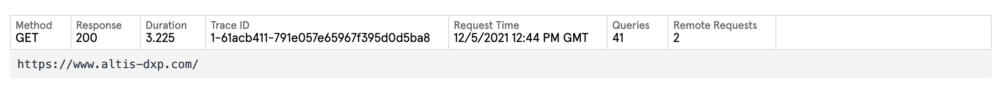
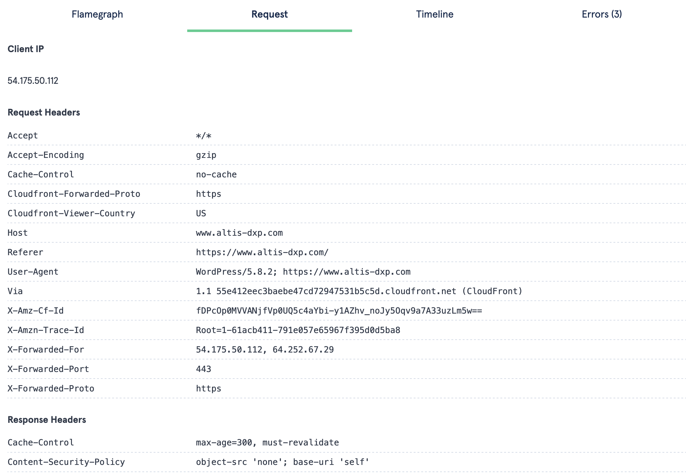
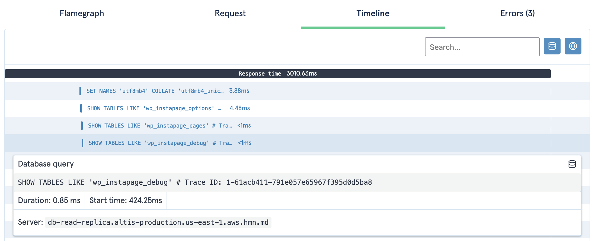

# XRay

The Altis Dashboard provides a way to view all backend PHP requests for developer debugging tasks and investigations. This feature is called XRay, and is available via the XRay tab on each application.

XRay traces provide performance profiling, database queries, remote requests and exposes all request data for each backend PHP request.

You can jump directly to the XRay trace for the current request by clicking the "Debug Request" link in the Query Monitor menu or the Altis logo menu in the admin bar.

<video controls src="https://www.altis-dxp.com/uploads/2020/07/altis-cloud-dashboard-xray.mp4"></video>

## Configuration

XRay is on by default but can be turned off using the following configuration:

```json
{
    "extra": {
        "altis": {
            "modules": {
                "cloud": {
                    "xray": true
                }
            }
        }
    }
}
```

## Searching XRay Requests


When debugging requests in Altis Cloud, it's typical to find the specific HTTP request you want to debug. The XRay interface is limited to showing 500 HTTP requests at a time, so it's advised to narrow your search down by timeframe, URL, or IP address. The "Before" and "After" fields accept any human readable format such as "30 minutes ago", or absolute timestamps. URLs, IPs or other fields can be specified via the "Filter Expression" search box. The Altis Dashboard provides contextual help via the "?" icon. Below are some common examples when using Filter Expressions:

**Show all requests to a specific URL**
```
http.url = "https://example.com/my-url/"
```

**Show all requests to a URL containing a term**
```
http.url contains "wp-admin"
```

**Show all requests from a specific IP address**
```
http.clientip = 1.2.3.4
```

## Understanding an XRay trace

Each HTTP request generates an "X-Ray trace" and provides many useful pieces of debugging information.

### Overview



The overview table provides quick information about the request, including requested URL, response time, response code, and external API calls to the database and remote servers.

### Flamegraphs


The flamegraph tab provides you with a full performance profile of the request, helping you to understand how the request was processed and executed.

The flamegraph is a graph showing the request time on the X axis, and the call stack / depth on the Y axis. Each entry in the call-stack forms a "segment", and you can hover over any segment to view more details or click it to zoom to just that segment. (Click on the top segment to zoom back out.)

Flamegraphs are taken from sampled profiles of the PHP process, at 5 millisecond intervals. Tall segments indicate a deep call-stack, but do not necessarily indicate a problem, while wide segments indicate slower operations. When investigating performance problems, start with the wide segments to understand what is taking a long time to run, and use the deeper segments to drill down and understand the operations taking place.

Note that as the resolution of the whole flamegraph is 5ms, all times are rounded. Fast functions may still appear in the flamegraph if they happened to be running when the sample was taken, and for this reason, flamegraphs are more valuable for slower requests. (A 5ms interval is used as the sampling rate to ensure negligible performance overhead when collecting the profiles.)

### Request Data



The request tab displays data sent to and served from the server, including the client IP, request and response headers, and any other statistics generated by the request. This can assist in debugging unexpected behaviour by replicating the conditions, or finding unexpected header values.

Some information is redacted from the request data, for privacy reasons, including user passwords. You can redact additional information by filtering `aws_xray.redact_metadata_keys` or `aws_xray.redact_metadata`:

```php
// Redact keys from the metadata:
add_filter( 'aws_xray.redact_metadata_keys', function ( $keys ) {
    $keys['$_POST'][] = 'rcp_user_pass';
    return $keys;
} );

// Or, manually alter or remove metadata:
add_filter( 'aws_xray.redact_metadata', function ( $metadata ) {
    foreach ( $metadata['response']['headers'] as &$header ) {
        if ( strpos( $header, 'secret_val' ) !== -1 ) {
            unset( $header );
        }
    }
    return $metadata;
} );
```

### Timeline



The timeline shows all database queries and remote requests chronologically, along with their duration.

Click any entry to view more details, including the duration and start time (time since the request started). For database queries, the full query and the database server name (e.g. primary or read replica) are displayed.

For remote requests, the HTTP response code is displayed. Only requests made through the [WordPress HTTP API](https://developer.wordpress.org/apis/handbook/making-http-requests/) or the AWS SDK will be shown.

Use the buttons in the top right to filter by type, or the search field to find specific queries or requests.

Note: The response time indicated is the time from the start of the request until the request is sent to the user and finished. When sending an early response (e.g. via `fastcgi_finish_request()`), queries and requests may occur after the request is finished; this will not count towards page load times experienced by your end users.

### Errors


Any PHP errors will be recorded for each X-Ray request and displayed in the Errors tab. Any errors triggered via `trigger_error()` will also be displayed here.
