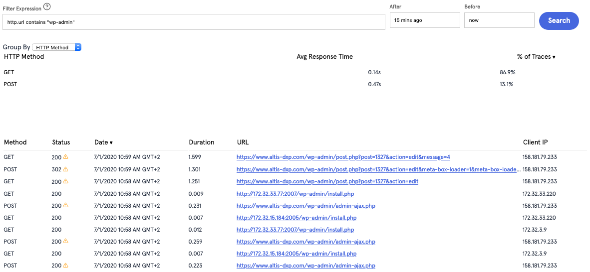
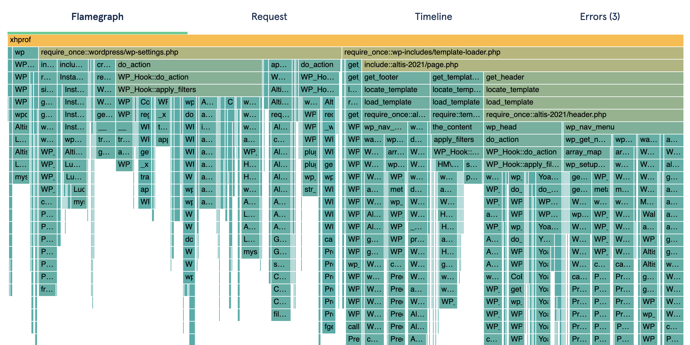
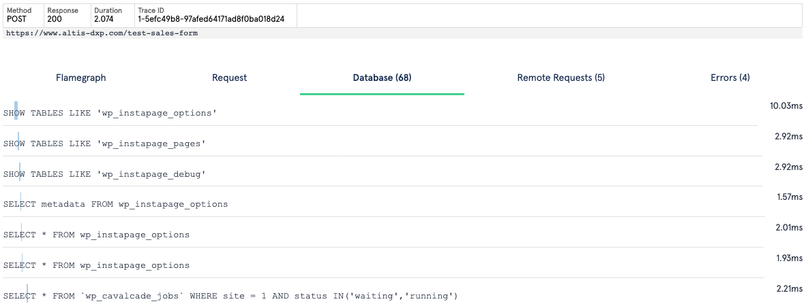
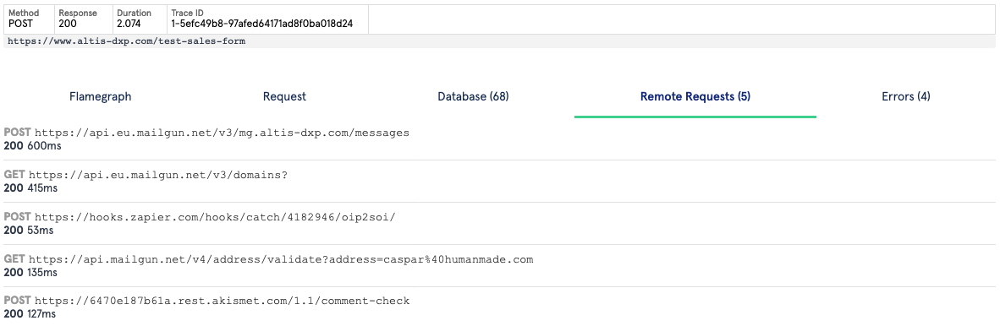
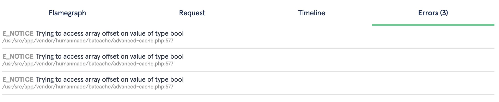

# XRay

The Altis Dashboard provides a way to view all backend PHP requests for developer debugging tasks and investigations. This feature is called XRay, and is available via the XRay tab on each application.

XRay traces provide performance profiling, database queries, remote requests and exposes all request data for each backend PHP request.

<video controls src="https://www.altis-dxp.com/uploads/2020/07/altis-cloud-dashboard-xray.mp4"></video>

## Searching XRay Requests



When debugging requests in Altis Cloud, it's typical to find the specific HTTP request you want to debug. The XRay interface is limited to showing 500 HTTP requests at a time, so it's advised to narrow your search down by timeframe, URL, or IP address. The "Before" and "After" fields accept any human readable format such as "30 minutes ago", or absolute timestamps. URLs, IPs or other fields can be specified via the "Filter Expression" search box. The Altis Dashboard provides contextual help via the "?" icon. Below are some common examples when using Filter Expressions:

**Show all requests to a specific URL**
```
http.url = "https://example.com/my-url/"
```

**Show all requests to a URL containing a term**
```
http.url contains "wp-admin"
```

**Show all requests from a specific IP address**
```
http.clientip = 1.2.3.4
```

## Understanding an XRay trace

Each HTTP request is called an "XRay trace" and provides many useful pieces of debugging information.

### Flamegraphs



XRay Flamegraphs provide you with a full performance profile of the HTTP request. Flamegraphs make it very easy to understand why a specific request is slow, and what the call-stack is for all parts of the page load.

The Flamegraph is a graph showing the request time on the X axis, and the call stack / depth on the Y axis. A tall Flamegraph segment represents a deep call-stack (not necessarily an indication of a problem) and a wide segment represents a slow operation (which can indicate a performance bottleneck).

Flamegraphs are taken from sampled profiles of the PHP process, at 5 millisecond intervals. This means the resolution of the whole Flamegraph is 5ms. Sampled profiles means there is negligible performance overhead to collecting such profiles.

### Request Data

Each Xray trace includes all of the request data, which can aid in debugging unexpected behaviour. The request data includes all `$_POST`, `$_GET` and `$_COOKIE`, `$_SERVER` values, and information for the HTTP response such as response code and all sent HTTP headers.

Some information is redacted from the request data, for privacy reasons.

### Database Queries



Each XRay trace tracks all database queries along with their duration. Each query has a visual indication in the form of a blue bar which represents the query time relative to the start and end time of the HTTP request, and the duration (width) of the blue bar.

### Remote Requests



All remote HTTP requests made by PHP using the `wp_remote_*` API functions are captured and displayed in each XRay trace. Any requests to downstream AWS services will also be displayed.

### Errors



Any PHP errors will be recorded for each XRay request and displayed in the Errors tab. Any errors triggered via `trigger_error()` will also be displayed here.
