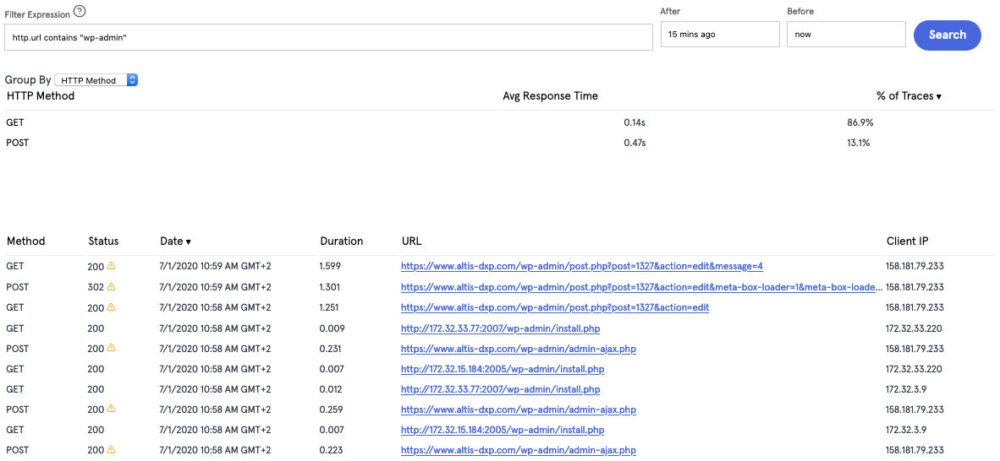
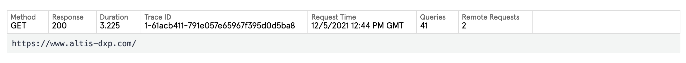
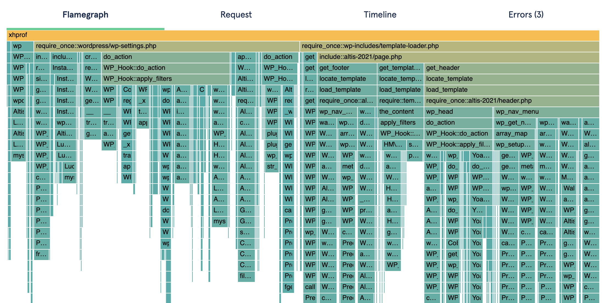
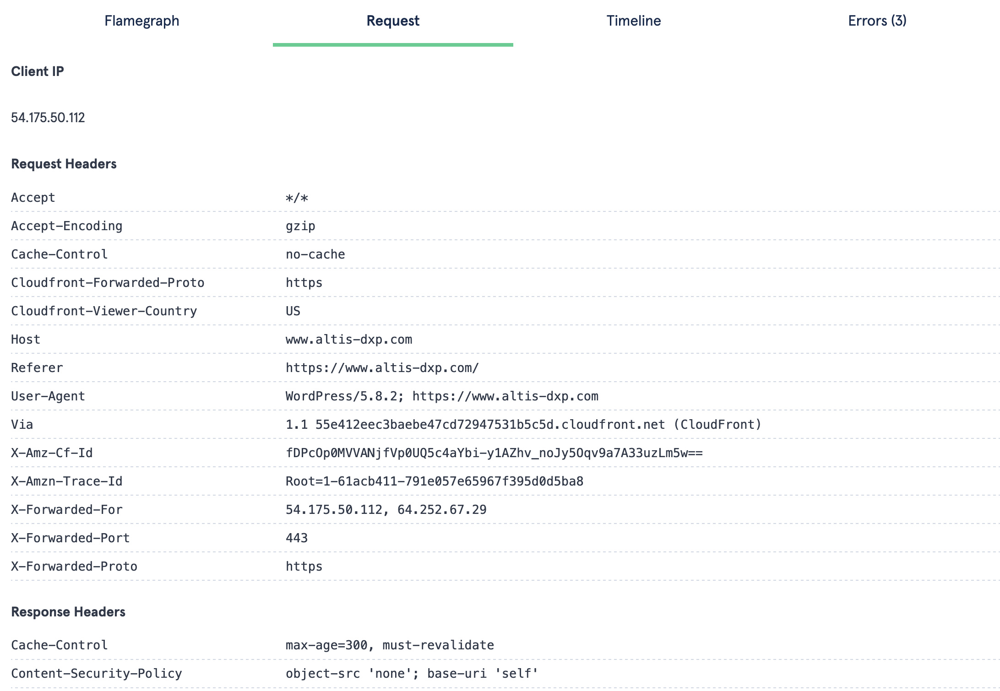
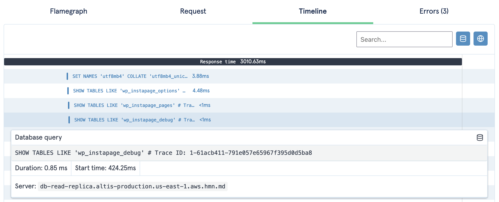
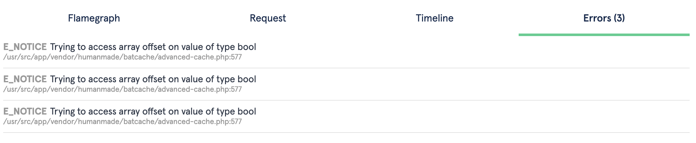

# X-Ray

Altis provides a way to dive deep into *any* backend PHP request, to find out details about the request and debug your application.

X-Ray includes Application Performance Monitoring (APM) infomration like time spent in your request, database queries, and remote requests. It also includes flamegraphs and timeline views, allowing you to pinpoint performance behaviour in your requests.

Unlike other APM tools you might have seen before (such as New Relic), X-Ray includes *every* request that hits PHP, allowing you to debug any problem.


## Introduction to X-Ray

<!-- markdownlint-disable MD033 -->
<video controls src="https://www.altis-dxp.com/uploads/2020/07/altis-cloud-dashboard-xray.mp4"></video>
<!-- markdownlint-enable MD033 -->


## Concepts

X-Ray is an Application Performance Monitoring (APM) tool, providing tools for performance monitoring and debugging.

Every time a request hits PHP, X-Ray saves data for the request as a "trace". X-Ray is optimized for high-scale traffic, allowing it to record a trace for *every* request that invokes your PHP backend.

(Pages served from the CDN cache, uploaded or assets, and blocked requests are not included in traces, as they never invoke PHP.)

X-Ray records a variety of data about the request into the trace, including request and response headers, database queries, and errors. It also samples the running process to provide a performance profile, displayed as a flamegraph.


## Overview

You can access the X-Ray overview for your application via the "X-Ray" link in the Altis Dashboard under each environment.

The overview screen shows you a variety of performance and debugging metrics for the most recent 15 minutes, giving you a quick overview of how your site is performing and behaving right now. (You can view up to 24 hours of data in this view with the duration selection in the top left.)

Each of these graphs uses the same time scale, and hovering any graph will let you see all points of data for the selected minute. This allows correlating pieces of data, such as an increase in number of requests with an increase in error rate.

The **response time** graph shows the overall average response time per minute, as well as the average time spent on database queries (both to the primary/writer and to the replica/reader) and object cache (Redis).

The **apdex** graph shows the perceived performance of the site, based on a threshold (`T`, 0.4s by default). Pages which load in `<T` are considered "satisfied", pages which load in `<4T` are considered "tolerating", and pages slower than this are considered "frustrated".

The **requests** graph shows how many requests are occurring each minute, along with an overall average for the current time window.

The **errors** graph shows how many faults (fatal errors) are occurring each minute, as well as how many requests have *any* error reported (including notices and warnings).


### Trace List

The trace list displays all traces for the selected time period, along with a summary by method, URL, or status code.



Traces can be filtered down using the time selector, or using filter expressions which show a subset of the data. The "?" button in the Altis Dashboard shows details on supported fields and syntax. Up to 500 traces can be displayed in the list at any time.

For example, you can use filter expressions to:

* **Show all requests to a specific URL**: `http.url = "https://example.com/my-url/"`
* **Show all requests to a URL containing a term**: `http.url contains "wp-admin"`
* **Show all requests from a specific IP address**: `http.clientip = 1.2.3.4`

Selecting any trace from the trace list will take you to the Trace screen.

**Tip:** You can jump directly from your site to the X-Ray trace for the current request by clicking the "Debug Request" link in the Query Monitor menu or the Altis logo menu in the admin bar.


## Understanding an X-Ray trace

Each HTTP request generates an "X-Ray trace" and provides many useful pieces of debugging information.

### Overview



The overview table provides quick information about the request, including requested URL, response time, response code, and external
API calls to the database and remote servers.

### Flamegraphs

The key tool for understanding the performance of a trace is the flamegraph view. Flamegraphs provide an overview of **what functions were running** and **how long they ran for**.



#### Call stack sampling

X-Ray creates flamegraphs by sampling the current "call stack" - similar to calling `debug_print_backtrace()` or `wp_debug_backtrace_summary()`. X-Ray records the call stack every 5 milliseconds (called the "sampling rate").

For example, this record may look like:
```
 0: a()
 5: a() -> b() -> c()
10: a() -> b()
15: a() -> b()
```

This call stack shows that at 0ms, `a()` was running; at 5ms, `c()` was running (called from `b()` which was called by `a()`), and at 10ms and 15ms, `b()` was running (called from `a()`).

Samples store the call stack at each time interval, but they don't indicate how many times the function was called. In the example above, `b()` may have been called once, or hundreds of times from `a()` - this is not recorded in the sample. When call stacks are displayed in flamegraphs, function calls are "merged" together for visualisation purposes.

Individual samples also only record the callstack at the exact moment they sample. This means that fast functions may never show at all, or conversely may appear just by chance of running at the exact moment the sample occurred. Even if a function takes less than 1ms, it may appear to take 5ms just by appearing in one sample.


#### Reading the flamegraph

The flamegraph displays the callstack at every 5ms sample, with time on the X axis, and the call stack on the Y axis. The width of each item indicates how long the function was in the callstack, while the stack shows the depth.

Wider elements indicate the function or functions it called took more of the request. Taller elements indicate a deeper call stack. As flamegraphs are displayed two-dimensionally, this allows seeing a holistic view of performance.

By default, the flamegraph is displayed chronologically; reading the graph from left to right roughly shows what tasks are being performed in the request, in order. Functions are merged together only when they are in subsequent samples. This view is useful for understanding the flow of the request over time, which can be useful for debugging.

The flamegraph can be reordered to "slowest first", which reorders the graph to show the slowest/heaviest functions on the left. This merges functions together more aggressively, so can be more useful for performing performance profiling.

Clicking any element in the flamegraph will "zoom in" to just that segment of the flamegraph, making it easier to see detail of deeper call stacks. When zoomed in, the width of the elements represents the percentage of the segment that has been zoomed in to, rather than the whole request. (Click the top element to zoom back out.)


#### Tips

* When debugging an issue, the call stack can tell you a lot about the behaviour of the request. Inspect which functions were called and when to help form a picture of what WordPress did internally.

    * For example, if you see that the request ends after `wp_head()` calls but you expect the rest of the page to take >5ms, this could indicate the page is exiting early. The "last" flamegraph captures may provide clues on how far the request go in rendering.

* Switch to "slowest first" view for a better picture for performance. This view groups together calls, even out of order, so gives a better indication of overall impact on the request.

* The largest impacts on your response time are from wide segments, so these represent the best place to begin debugging performance issues. Looking at the deeper call stack tells you what the contributors to that segment were. To get a picture of the slowest parts of your page load, look for wide and deep segments, as these tend to indicate slow low-level functions (such as database queries, etc).

* Don't worry too much about skinny segments, especially those which are only 5ms - these may indicate functions which just happened to be running when the sample took place. (5ms is the sampling interval.)


### Request

The Request tab provides information about the request overall. This includes timing information (such as time spent in cache requests or database queries), request and response headers, and metadata about the request.



The **Information** section provides timing and routing information, including the client IP address, and time spent in various components.

* **Total (Wall) Time** is the total time taken from when the request first hit the CDN until the final byte was sent, as measured by a wall clock.
* **PHP-FPM → Queue Time** is the time PHP spent waiting for a worker to handle the request.
* **PHP → Total Time** is the time the PHP worker spent on the request.
* **PHP → System Time** is the time the PHP worker spent waiting for operating system calls.
* **PHP → User Time** is the time the PHP worker spent executing the PHP codebase.
* **Database → Query Time** is the total time spent waiting for database queries.
* **Object Cache → Time** is the total time spent waiting for object cache (Redis) calls.
* **Object Cache → Hits** is the total number of cache fetches which "hit" - i.e. were served from Redis.
* **Object Cache → Misses** is the total number of cache fetches which "missed" - i.e. returned no data from Redis.

In general, Total (Wall) Time represents how long the user had to wait, and User Time represents what portion was spent running your code (excluding time waiting for the database or cache). Database query time should be minimized where possible, although may lead to an increase in object cache time (however, the cache is generally faster than the database). Object cache misses should be minimized as much as practical to ensure most data comes from the cache rather than the database, but 0 is almost never practical.

The **Request Headers** and **Response Headers** sections provide the HTTP headers sent to PHP and sent from PHP respectively. These headers provide useful information for debugging and understanding the behaviour.

Note that these headers do not include any headers which were not passed to PHP (e.g. user-agent), nor any headers generated by the firewall or CDN.

Some information is redacted (obfuscated/censored) from the request data, for privacy reasons. This includes user passwords on the wp-login screen and two-factor authentication codes.

The **Raw Metadata** and **Raw Annotations** sections provide a way to view any custom metadata or annotations.

#### Redacting more data

You can redact additional information by filtering `aws_xray.redact_metadata_keys` or `aws_xray.redact_metadata`:

```php
add_filter( 'aws_xray.redact_metadata_keys', function ( $keys ) {
    $keys['$_POST'][] = 'rcp_user_pass';
    return $keys;
} );
```

(Available keys are `$_GET`, `$_POST`, `$_COOKIE`, `$_SERVER`, and `response`. Be careful to set these as strings, not the variable itself!)

X-Ray will automatically replace any values matching these keys with `REDACTED`, allowing you to see that there was a value, but removing it.

You can also manually alter or remove metadata, such as to censor specific values:

```php
add_filter( 'aws_xray.redact_metadata', function ( $metadata ) {
    foreach ( $metadata['response']['headers'] as &$header ) {
        if ( strpos( $header, 'secret_val' ) !== -1 ) {
            unset( $header );
        }
    }
    return $metadata;
} );
```


### Timeline

The Timeline tab provides a chronological record of all database queries and remote requests, along with their duration.



X-Ray automatically records all database queries made via wpdb, and remote (HTTP) requests made via the [WordPress HTTP API](https://developer.wordpress.org/apis/handbook/making-http-requests/) or the AWS SDK.

These are displayed on the timeline screen, with one row per query or request. Each bar indicates when the request started, and how long it ran for. This uses the same timescale as the flamegraph screen (in chronological view), allowing correlation of slow parts of the request with queries or remote requests.

Each bar can be clicked on to view more details, including the duration, start time, and full query/request URI. For database queries, the query ID and database server name (e.g. primary or read replica) are also displayed.

The timeline can be filtered to just queries or remote requests via the filter button in the top right, and the search field provides a way to find specific items.

Note that the response time indicated is the time from the start of the request until the request is sent to the user and finished. When
sending an early response (e.g. via `fastcgi_finish_request()`), queries and requests may occur after the request is finished; this
will not count towards page load times experienced by your end users. The moment the request finishes is indicated by a black vertical line.


### Errors

The Errors tab provides a list of all PHP errors, warnings, and notices that occurred during the request.



All errors will be displayed here regardless of the `error_reporting` configuration in the application. Additionally, any errors manually triggered via `trigger_error()` calls will be displayed here.


## Limitations and Notes

* X-Ray only records requests which invoke PHP. Any requests which are served from the CDN cache, blocked by the firewall, or routed to other backends will not appear in X-Ray.
    * The `/uploads/` and `/tachyon/` routes for images are routed by the CDN directly to asset storage and Tachyon directly, and do not invoke PHP.
    * Pages served from Batcache rather than the CDN cache *will* appear in X-Ray.

* Scheduled tasks run via Cavalcade do not appear in X-Ray.

* CLI commands (such as wp-cli) do not appear in X-Ray.

* X-Ray traces are only retained for 30 days for privacy and technical reasons. This retention is not configurable - if you do not want to retain/record private data, use the redaction filters to remove the data from the trace.
