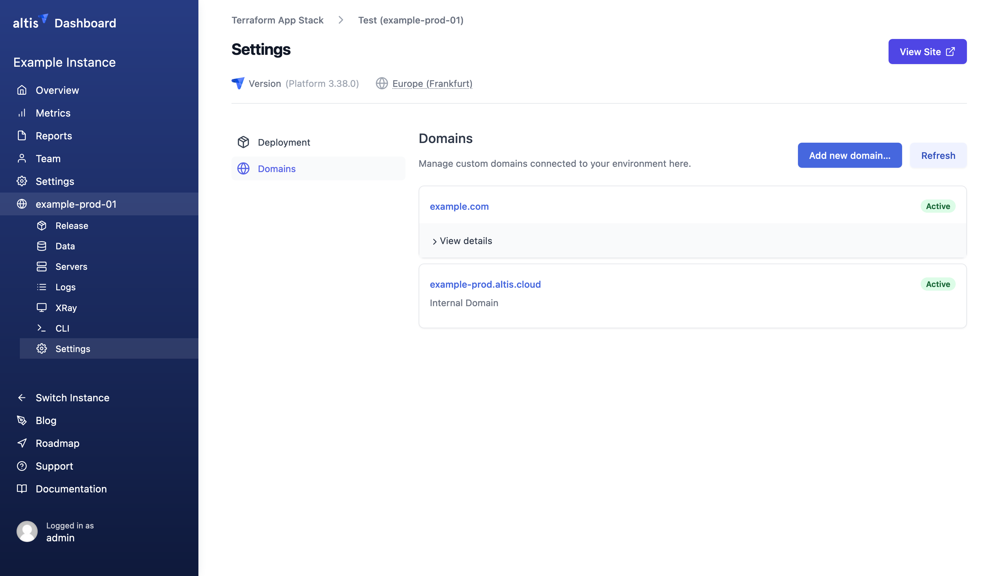

# DNS Configuration

Every Altis environment can have many domains configured, allowing seamless use of multisite across your network.

You can view your domain settings within the Altis Dashboard: select your environment's Settings page, then select the Domains
setting. You'll be able to view all your existing domains here, as well as add new domains.

## Adding a domain

Adding a new domain to Altis is a three step process.

1. **Register domain with CDN** (registration)
2. **Add verification DNS records** (verification)
3. **Add CNAME/ALIAS DNS records** (switch-over)

Note that this is only necessary for adding new top-level domains which have not already been configured. Wildcard subdomain
configuration will allow you to add new sub-sites without requiring DNS changes.

We recommend beginning this process at least a few weeks before your desired switch-over. User-visible changes to your site will
only happen during the switch-over stage, and there will be no visible change to your site before this.

### Registration (CDN configuration)

Before routing domains to Altis, you need to register the domain with the Altis infrastructure and CDN. This tells Altis that you
want to associate the domain with the specific environment, and that the CDN should route requests to the environment.

(This is not the same as domain registration, and Altis does not act as your registrar. Altis does not currently offer the ability
to purchase new domains.)

To start with the registration process, select the "Add new domain…" button.

**Note:** The new domains feature is rolling out progressively, and you may not yet be able to see the "Add new domain"
button. [Contact Altis support](support://new) to enable the new domains feature.

Enter your base domain, excluding any `www.` or wildcards.

The next screen allows you to select which variants of the domain you want to add: either just this domain, with the `www.`
subdomain, or with a wildcard subdomain. We recommend selecting a wildcard subdomain to enable the full suite of multisite
capabilities for your domain, as this will avoid needing further manual steps when adding new subdomain sites in the future.

Once you've selected the domains you wish to add, select "Add domain" to register the domain with the CDN.

If you need to set up a more complex domain configuration (such as adding a wildcard to an already-registered
domain), [contact Altis support](support://new).

### Verification

Altis automatically issues SSL certificates and configures the CDN to serve these certificates to users. When adding a new domain,
verification will be required to ensure that you control the domain.

Once you register the domain in the Altis Dashboard, you'll receive DNS information for verification in the form of CNAME records.
These are provided by AWS, and reference `acm-validations.aws`.

You can visit the Domains settings page at any time to view these records again if needed.

These records must be added before the regular web CNAME records are added, allowing Altis to verify your domain ahead of
switch-over. These will not conflict with existing records, and will have no user impact.

**Note:** Once the DNS records have been provided by Altis, please endeavour to add them within 72 hours, as they may time out after
this, and will be marked as "Failed". If a domain is marked as Failed, [contact Altis support](support://new) to continue the
process.

### Switch-over

Once your domain has been verified, Altis will automatically update your environment to prepare it for switchover.

The final step is to route your custom domain to your Altis environment. This is done by adding a `CNAME` DNS record for your domain
or subdomains.

The value for your CNAME record will be displayed on the Domains settings page, as well as your verification records. (Make sure you
don't delete the verification records, as they're needed for certificate renewal.)

After these DNS changes are put into place, your site will be served by Altis; this is called the "switch-over", as your site will "
switch" from any existing host to Altis.

You can perform this step when you're ready to switch your traffic at any point after verification is complete.

Altis can only provide host names to be used in DNS records, not IP addresses, as servers are dynamically allocated based on
traffic. Therefore you *must* use CNAME, ANAME, or ALIAS records when configuring and managing your own DNS.

#### CNAME records

The simplest way to route your domain to Altis is to add CNAME records for any subdomains you wish to use. For example, you may wish
to use the `www.` subdomain for your main site.

The Dashboard will show you your project-specific domain to use in CNAME record.

CNAME records are not supported on the domain apex (or "naked domain"); this is the base domain without `www.`, such
as `example.com`. For apex domains, you must use either ALIAS or ANAME records as supported by your DNS provider.

#### ALIAS/ANAME records

Commonly, you will want to implement a redirect from the domain apex to the subdomain, such as redirecting `example.com`
to `www.example.com`.

There are three options to support this in Altis Cloud:

1. Use ANAME/ALIAS records, as supported by your DNS provider
2. Use your domain registrar to redirect the domain apex to the subdomain
3. Use Altis managed name servers (see below)

Where possible, we recommend using ANAME/ALIAS records. These operate similarly to CNAME records, but can be used on the domain
apex. However, not all registrars support these records, as they are relatively new.

You may also be able to use your registrar's redirection function. Many domain registrars support this service, and typically call
it "web forwarding" or "web redirect".

## Managed name servers

Altis can manage DNS records for you. This will require setting Altis as the authoritative name server for your domain, allowing us
to manage verification and CNAME/ALIAS records on your behalf.

This has some advantages and disadvantages:

### Advantages

- The domain apex can be used to either host your Altis properties or provide apex redirects such as `example.com`
  to `www.example.com`
- Altis Cloud can manage and verify SSL certificates on your behalf
- Altis Cloud can validate email sending domains, and manage DKIM and SPF records on your behalf

### Disadvantages

- Any external DNS updates you want to make will need to be handled via Altis Support requests
