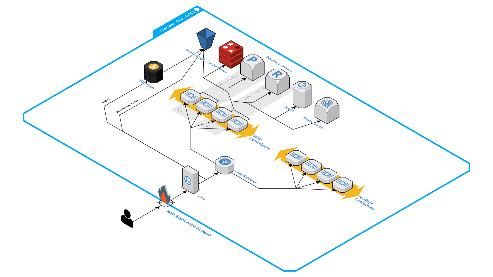

# Node.js

For customers building headless or decoupled sites, Altis Cloud offers Node.js hosting, perfect for server-side
rendering.

**Optional Add-On**: Node.js hosting is available as an optional add-on to your Altis Cloud subscription, available on
any plan. Contact your account manager for more information about pricing.

## How it works

Node.js hosting integrates directly into your existing Altis Cloud environment.

Alongside your regular application containers (running WordPress), we run a second set of containers just for Node.js.
These benefit from the same autoscaling architecture as your application servers, the Altis CDN, and WAF.

Just like your application cluster, each environment gets its own Node.js cluster. This allows you to test development
and staging environments just like your production environment, without needing complex application-level logic within
your Node.js application to switch between different backends.

Your Node.js containers run alongside your application (WordPress + PHP) containers and independently autoscale to meet
the traffic demand. Altis routes traffic to either your application or Node.js containers depending on the hostnames
attached to each.

Since the Node.js containers live with your application, they also sit behind the Altis [CDN](../cdn/README.md)
and [firewall](../firewall.md). Using standard HTTP cache control headers, you can enable super-fast page loads right
from the user's closest CDN edge node.

## Supported frameworks

Currently, Altis only officially supports the [Next.js framework](https://nextjs.org/) running on Node.js v18, v20, or
v21.

For further information, see the [supported frameworks documentation](./frameworks.md).
